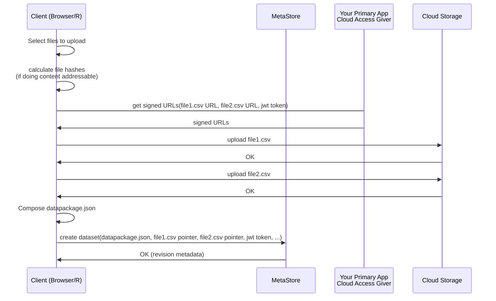

# Blob Storage

Blob Storage can be provided via:

* Local file system
* Cloud storage

## CKAN 2 (Classic)

TODO: discussion of ckanext-cloudstorage

## Direct to Cloud Upload

Want: Direct upload to cloud storage ... But you need to authorize that ... So give them a token from your app

A sequence diagram illustrating the process for a direct to cloud upload:

Questions

* What is file structure in cloud ... i.e. What is the file path for uploaded files? Options
  * Client chooses a name/path
  * Content addressable i.e. the name is given by the content? How? Use a hash.]
    * Beauty of that: standard way to name things. The same thing has the same name (modulo collisions)
    * Goes with versioning => same file = same name, diff file = diff name
* And do you enforce that from your app
  * Request for token needs to include the destination file path

## Azure

### Can you do multi-part uploads with SAS in Azure? (and with the SDK?)

Not sure ... atm

See https://github.com/Azure/azure-storage-php/issues/170

https://docs.microsoft.com/en-us/rest/api/storageservices/put-block-list

https://github.com/ojczeo/vue-azure-multipart-upload

