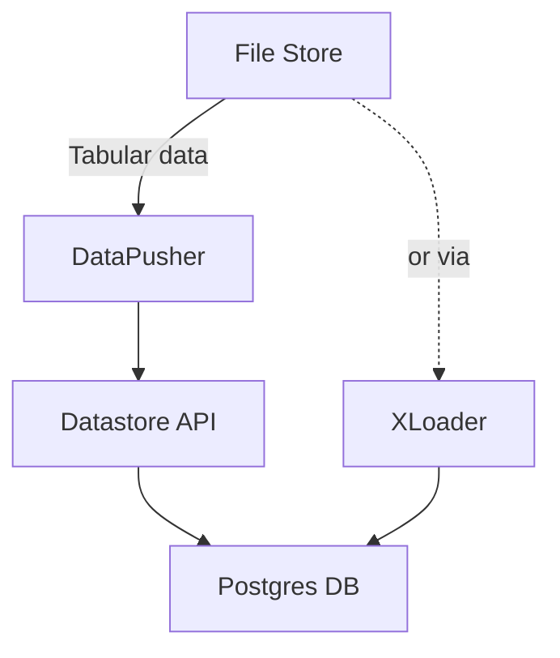
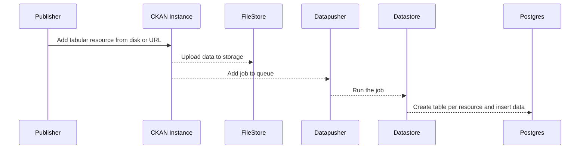
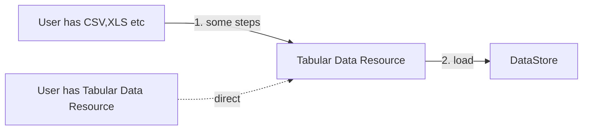

# Data APIs (and the DataStore)

Much of the richer functionality of Data Portals such as data visualization and exploration require API data access rather than bulk download. Data APIs provide this functionality.

:::tip
Data APIs covers the DataStore functionality in CKAN. We prefer Data API over DataStore as a term because it shifts the focus to the functionality (the API) rather than the underlying implementation (a structured data storage such as RDBMS).
:::

## Introduction

A Data API provides *API* access to data stored in a Data Portal. APIs provide granular, per record access to datasets and their component data files. They offer rich querying functionality to select the records you want, and, potentially, other functionality such as aggregation. Data APIs can also provide write access, though this has traditionally been rarer.[^rarer]

[^rarer]: It is rarer  because write access usually means a) the data for this dataset is a structured database rather than a data file (which is normally more expensive both in terms b) the Data Portal has now become the primary (or semi-primary) home of this dataset rather simply being the host of a dataset whose home and maintenance is elsewhere.

### API vs Bulk Access

Direct download of a whole data file is the default method of access for data in a data portal. API access complements this "bulk", direct download approach, and, in some situations may become the primary access option (so-called "API first"), or, even replace it -- for example, data may be stored solely in a structured database with read and write APIs as the default access method.

*Fig 1: Contrasting Download and API based access*

```bash
# simple direct file access. You download 
https://my-data-portal.org/my-dataset/my-csv-file.csv

# API based access. Find the first 5 records with 'awesome'
https://my-data-portal.org/data-api/my-dataset/my-csv-file-identifier?q=awesome&limit=5
```

In addition, to differing volume of access, APIs often differ from bulk download in their data format: following web conventions data APIs usually return the data in a standard format such as JSON (and can also provide various other formats e.g. XML). By contrast, direct data access necessarily supplies the data in whatever data format it was created in.

### Limitations of APIs

Whilst Data APIs are in many ways more flexible than direct download they have disadvantages:

* APIs are much more costly and complex to create and maintain than direct download
* API queries are slow and limited in size because they run in real-time in memory. Thus, for bulk access e.g. of the entire dataset direct download is much faster and more efficient (download a 1GB CSV directly is easy and takes seconds but attempting to do so via the API may crash the server and be very slow).

TODO: do more to compare and contrast download vs API access (e.g. what each is good for, formats,  etc)


### Why Data APIs?

Data APIs underpin the following valuable functionality on the "read" side:

* **Data (pre)viewing**: reliably and richly (e.g. with querying, mapping etc). This makes the data much more accessible to non-technical users.
* **Visualization and analytics**: rich visualization and analytics may need a data API (because they need easily to query and aggregate parts of dataset).
* **Rich Data Exploration**: when exploring the data you will want to explore through a dataset quickly only pulling parts of the data and drilling down further as needed.
* **(Thin) Client applications**: with a data API third party users of the portal can build apps on top of the portal data easily and quickly (and without having to host the data themselves)

Corresponding job stories would be like:

* When building a visualization I want to select only some part of a dataset that I need for my visualization so that I can load the data quickly and efficiently.
* When building a Data Explorer or Data Driven app I want to slice/dice/aggregate my data (without downloading it myself) so that I can display that in my explorer / app.

On the write side they provide support for:

* **Rapidly updating data e.g. timeseries**: if you are updating a dataset every minute or every second you want an append operation and don't want to store the whole file every update just to add a single record
* **Datasets stored as structured data by default** and which can therefore be updated in part, a few records at a time, rather than all at once (as with blob storage)


## Data APIs have 4 Core Components

The functionality associated to the Data APIs can be divided in 4 areas:

* **Read API**:  web API for accessing structured data (i.e. per record) with querying etc.
  * Custom API & Complex functions: e.g. aggregations, join
  * Permissions
  * Tracking & Analytics: rate-limiting etc 
* **Data Load / Ingest**: loading data in bulk into the system that powers the data API. 
  * Bulk Load: bulk import of individual data files
  * Write API: usually secondary because of its limited performance vs bulk loading
  * Maybe includes some ETL => this takes us more into data factory
* **Bulk Export**: of query results especially large ones (or even export of the whole dataset in the case where the data is stored directly in the DataStore rather than the FileStore). This is usually a lower priority but if required it is substantive feature to implement.
* **DataStore (Structured Store)**: the underlying structured store for the data. This could be considered a separate component that the Data API uses or as part of the Data API -- in some cases the store and API are completely wrapped together, e.g. ElasticSearch is both a store and a rich Web API.

:::tip
**Visualization** is not part of the API but the demands of viz are important in designing the system
:::


### Read API

#### Retrieve records via an API with filtering (per resource) (if tabular?)

When I am building a web app, a rich viz, display the data, etc I want to have an API to data (returns e.g. JSON, CSV) [in a resource] so that I can get precise chunks of data to use without having to download and store the whole dataset myself

* I want examples
* I want a playground interface …

#### Multiple Formats

When querying data via the API I want to be able to get the results in different formats (e.g. JSON, CSV, XML (?), ...) so that I can get it in a format most suitable for my client application or tool

#### Aggregate data (perform ops) via an API …

When querying data to use in a client application I want to be able to perform aggregations such as sum, group by etc so that I can get back summary data directly and efficiently (and don't have to compute myself or wait for large amounts of data)

#### SQL API

When querying the API as a Power User I want to use SQL so that I can do complex queries and operations and reuse my exisitng SQL knowledge

#### GeoData API

When querying a dataset with geo attributes such as location I want to be able use geo-oriented functionality e.g. find all items near X so that I can find the records I want by location

#### Free Text Query (Google Style / ElasticSearch Style) 

When querying I want to do a google style search in data e.g. query for "brown" and find all rows with brown in them or do `brown road_name:*jfk*` and get all results with brown in them and whose field `road_name` has `jfk` in it so that I can provide a flexible query interface to my users

#### Custom Data API

As a Data Curator I want to create a custom API for one or more resources so that users can access my data in convenient ways …

* E.g. query by dataset or resource name rather than id ...

#### Search through all data (that is searchable) / Get Summary Info

As a Consumer I want to search across all the data in the Data Portal at once so that I can find the value I want quickly and easily … (??)

#### 

As a Consumer (researcher/student …) I want to look for datasets with particular variables in  them so that I can quickly locate the data I want for my work

* Search across the column names so that ??


#### Track Usage of my Data API

As a DataSet Owner I want to know how much my Data API is being used so that I can report that to stakeholders / be proud of that

#### Limit Usage of my Data API (and/or charge for it)

As a Sysadmin I want to limit usage of my Data API per user (and maybe charge for above a certain level) so that I don’t spend too much money

#### Restrict Access to my Data API

As a Publisher I want to only allow specific people to access data via the data API so that …

* Want this to mirror the same restrictions I have on the dataset / resources elsewhere (?)

#### UI for Exploring Data

:::warning
This probably is *not* a Data API epic -- rather it would come under the Data Explorer.
:::

* I want an interface to “sql style” query data
* I want a filter interface into data
* I want to download filtered data
* ...


### Data Load

As a Publisher i want to load my dataset (resource) into the DataStore quickly and reliably so that my data is available over the data API

* Be “tolerant” where possible of bad data …
* And get feedback if it went wrong and how I can fix it …
* I want to update the schema for the DataStore so data has right types (and be
* I want to be able to update with a new resource file and only have it load the most recent

#### Correct the types in the DataStore (after load?)

#### Track Performance Status as [Cloud] Sysadmin

As a Datopian Cloud Sysadmin I want to know what is happening with “DataLoad” so that I can fix if problems for clients

#### One Data Load Service per Cloud

As a Datopian Cloud Manager I want to have one “DataLoad” service I maintain rather than one per instance for efficiency …

### Bulk Export

When I have a query with a large amount of results I want to be able to download all of those results so that I can analyse them with my own tools


### DataStore

When creating a Data API I want a structured data store (e.g. relational database) so that I can power the Data API and have it be fast, efficient and reliable.


## CKAN 2 (CKAN Classic)

In CKAN 2 the bulk of this functionality is in the core extension `ckanext-datastore`:

* https://docs.ckan.org/en/2.8/maintaining/datastore.html
* https://github.com/ckan/ckan/tree/master/ckanext/datastore

In summary: the underlying storage is provided by a Postgres database. A dataset resource is mapped to a table in Postgres. There are no relations between tables (no foreign keys). A read and write API is provided by a thin Python wrapper around Postgres. Bulk data loading is provided in separate extensions.

### Implementing the 4 Components

Here's how CKAN 2 implements the four components described above:

* Read API: is provided by an API wrapper around Postgres. This is written as a CKAN extension written in Python and runs in process in the CKAN instance.
	* Offers both classic Web API query and SQL queries.
	* Full text, cross field search is provided via Postgres and creating an index  concatenating across fields.
	* Also includes a write API and functions to create tables
* DataStore: a dedicated Postgres database (separate to the main CKAN database) with one table per resource.
* Data Load: provided by either DataPusher (default) or XLoader. More details below.
	* Utilize the CKAN jobs system to load data out of band
	* Some reporting integrated into UI
	* Supports tabular data (CSV or Excel) : this converts CSV or Excel into data that can be loaded into the Postgres DB.
* Bulk Export: you can bulk download via the extension using the dump functionality https://docs.ckan.org/en/2.8/maintaining/datastore.html#downloading-resources
	* Note however this will have problems with large resources either timing out or hanging the server

### Read API

The CKAN DataStore extension provides an ad-hoc database for storage of structured data from CKAN resources.

See the DataStore extension: https://github.com/ckan/ckan/tree/master/ckanext/datastore 

Datastore API: https://docs.ckan.org/en/2.8/maintaining/datastore.html#the-datastore-api

Making Datastore API requests: https://docs.ckan.org/en/2.8/maintaining/datastore.html#making-a-datastore-api-request

Example: Create a DataStore table: https://docs.ckan.org/en/2.8/maintaining/datastore.html#ckanext.datastore.logic.action.datastore_create

```sh
curl -X POST http://127.0.0.1:5000/api/3/action/datastore_create \
	-H "Authorization: {YOUR-API-KEY}" \
	-d '{ "resource": {"package_id": "{PACKAGE-ID}"}, "fields": [ {"id": "a"}, {"id": "b"} ] }'
```


### Data Load

Provided by either DataPusher or XLoader.

#### DataPusher

Service (API) For pushing tabular data to datastore.

Do not confuse with ckanext/datapusher in ckan core codbase. That's simply an extension communicating with the DataPusher API. That is a standalone service , running separately from CKAN app.

https://github.com/ckan/datapusher

https://docs.ckan.org/projects/datapusher/en/latest/

https://docs.ckan.org/en/2.8/maintaining/datastore.html#datapusher-automatically-add-data-to-the-datastore

#### XLoader

Does simple load into DB as strings and then casts. As a result much faster than DataPusher. However, you then need to do explicit data-casting after the fact.

https://github.com/ckan/ckanext-xloader

* `load_csv`: https://github.com/ckan/ckanext-xloader/blob/master/ckanext/xloader/loader.py#L40
* Loader: https://github.com/ckan/ckanext-xloader/blob/master/ckanext/xloader/jobs.py#L100

How does the queue system work: job queue is done by RQ, which is simpler and is backed by Redis and allows access to the CKAN model. Job results are currently still stored in its own database, but the intention is to move this relatively small amount of data into CKAN's database, to reduce the complication of install.

#### Flow of Data in Data Load


 
Sequence diagram showing the journey of a tabular file into the DataStore:



#### FAQs

Q: What happens with non-tabular data?
A: CKAN has a list of types of data it can process into the DataStore (TODO:link) and will only process those.

### DataStore

Implemented as a separate Postgres Database.

https://docs.ckan.org/en/2.8/maintaining/datastore.html#setting-up-the-datastore

### What Issues are there?

Sharp Edges

* connection between MetaStore (main CKAN objects DB) and DataStore is not always well maintained e.g, if I call “purge_dataset” action, it will remove stuff from MetaStore but it won’t delete a table from DataStore. This does not break UX but your DataStore DB raises in size and you might have junk tables with lots of data.
* No connection between DataStore system and CKAN validation extension powered by GoodTables https://github.com/frictionlessdata/ckanext-validation Thus, for example, users may edit the DataStore Data Dictionary and be confused that this has no impact on validation. More generally, data validation and data loading might naturally be part of one overall ETL process but Data Load system is not architected in a way that makes this easy to add.
	* Even more generally, the Data Load system is an hand-crafted, bespoke mini-ETL process. It would seem better to use high-quality third-party ETL tooling here rather than hand-roll be that for pipeline creation, monitoring, orchestration etc.

DataStore (Data API)

* One table per resource and no way to join across resources
* Indexes are auto-created and no way to customize per resource. This can lead to issues on loading large datasets.
* No API gateway (i.e. no way to control DDOS’ing, to do rate limiting etc)
* SQL queries not working (with private datasets)

Data Load [So-so]

* No support for Frictionless Data spec sand their ability to specific incoming data structure (CSV format, encoding, column types etc).
	* Dependent on error-prone guessing of types or manual type conversion
	* Makes it painful to integrate with broader data processing pipeline (e.g. clean separation would allow type guessing to be optimized elsewhere in another part of the ETL pipeline)
* Excel loading won't work or won't load all sheets 
* DataPusher
	* https://github.com/ckan/ckanext-xloader#key-differences-from-datapusher
	* Works terribly with loading a bit big data. It may for no reason crash after hour of loading. And after reload it goes along
	* Is slow esp for large datasets and even smallish datasets e.g. 25Mb
	* often fails due to e.g. data validation/casting errors but this not clear (and unsatisfying to the user)
* XLoader:
	* Doesn't work with XLS(X)
	* has problems fetching resources from Blob Storage (it fails and need to wait until the Resource is uploaded.)
	* raising Exception NotFound when CKAN has a delay creating resources 
	* re-submits Resources when creating a new Resource
	* XLoader sets `datastore_active` before data is uploaded


## CKAN 3 (Next Gen)

Following the general [next gen microservices approach][ng], the Data API is separated into distinct microservices.

<iframe src="https://docs.google.com/spreadsheets/d/e/2PACX-1vTseHlGgyLLyLMHcBhwR5iNVcXxVgf0pY-N7qRW1dyW2RqXaYAagDO1G_xzT7FJq3F7EWdCtEb_CLuc/pubhtml?gid=201228653&amp;single=true&amp;widget=true&amp;headers=false" width="100%" height="500"></iframe>

[ng]: /next-gen/

### Read API

Approach: Refactor current DataStore API into a standalone microservice. Key point would be to break out permissioning. Either via a call out to separate permissioning service or a simple JWT approach where capability is baked in.

Status: Design Phase

### Data Load

Key points: this is classic ETL -- let's reuse those patterns and tooling.

* Run as a separate microservice with zero coupling with CKAN core code (=> gives cleaner separation and testing)
* Use Frictionless Data patterns and specs where possible e.g. Table Schema for describing or inferring the data schema
* Use common ETL / [Data Flows][] patterns and frameworks

[Data Flows]: /flows/

Status: Alpha Implementation

* Spec of new Data Loader: https://gitlab.com/datopian/tech/data-loader-next-gen/issues/1
* Working Data Loader (in progress): https://gitlab.com/datopian/data-loader-next-gen

#### Design

:::warning
This is incomplete
:::

Crude Overview



What is a Tabular Data Resource? See Frictionless Specs. For our purposes:

* A "Good" CSV file: Valid CSV - with one header row, No blank header etc...
* Encoding worked out -- usually we should have already converted to utf-8
* Dialect - https://frictionlessdata.io/specs/csv-dialect/
* Table Schema https://frictionlessdata.io/specs/table-schema

NB: even if you want to go direct loading route (a la XLoader) and forget types you still need encoding etc sorted -- and it still fits in diagram above (Table Schema is just trivial -- everything is strings).


### DataStore

Back onto Postgres by default just like CKAN 2. May also explore using other backends esp from Cloud Providers e.g. BigQuery or AWS RedShift etc.

<mermaid />

