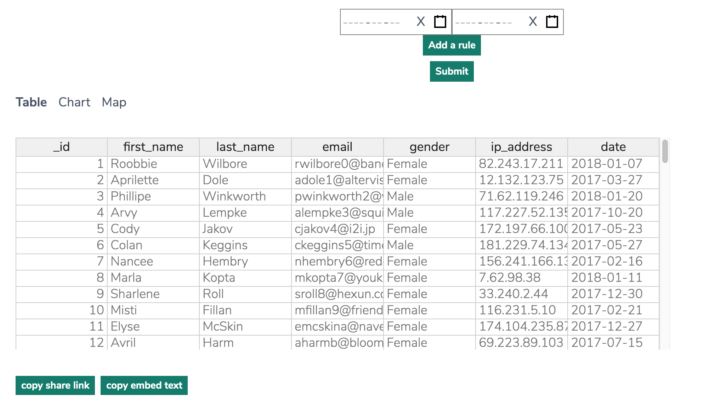
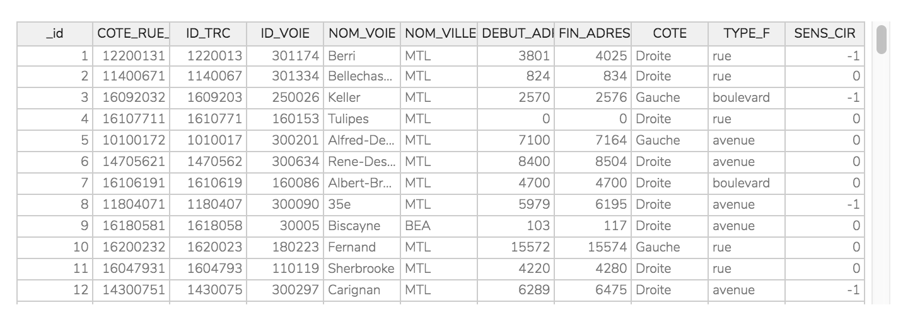
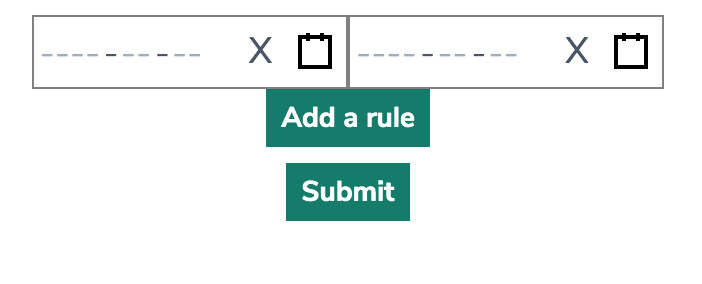
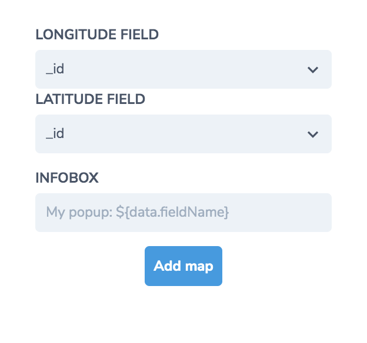
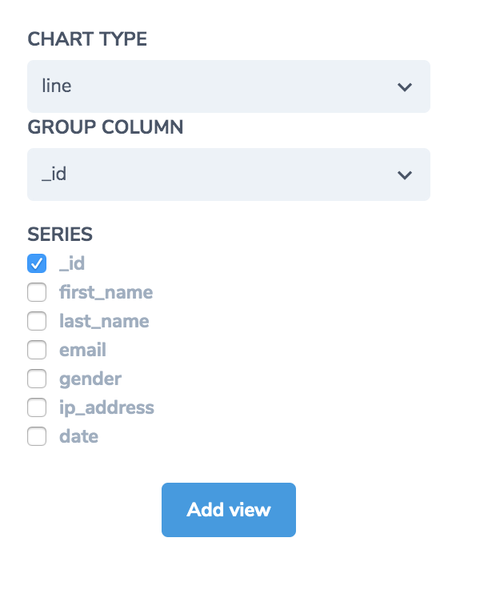
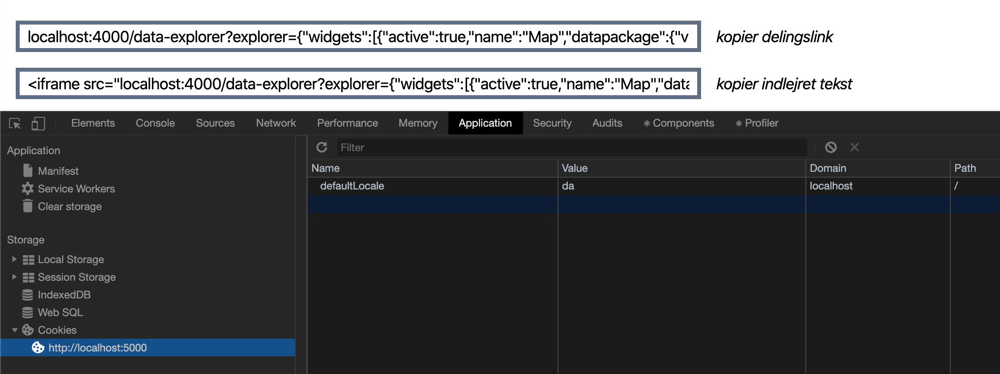

::: warning
**These docs are a work in progress!**

If you have issues, [submit an issue](https://gitlab.com/datopian/tech/tech.datopian.com/issues).

If you have improvements, [submit a merge request](https://gitlab.com/datopian/tech/tech.datopian.com/merge_requests)
:::

# Data Explorer


> [Data Explorer for the City of Montreal](http://montreal.ckan.io/ville-de-montreal/geobase-double#resource-G%C3%83%C2%A9obase%20double)

## Features / Highlights

"Data Explorer" is an embedable React/Redux application that allows users to:

* Explore tabular, map, PDF, and other types of data
* Create map views of tabular data using the [Map Builder](#map-builder)
* Create charts and graphs of tabular data using [Chart Builder](#chart-builder)

## Components

The Data Explorer application acts as a coordinating layer and state management solution -- via [Redux](https://redux.js.org/) -- for several libraries, also maintained by Datopian.

### [Datapackage Views](https://github.com/datopian/datapackage-views-js)



Datapackage View is the rendering engine for the main window of the Data Explorer.

The above image displays a table shown at the `Table` tab, but note that Datapackage-views renders _all_ data visualizations: Tables, Charts, Maps, and others.

### [Datastore Query Builder](https://github.com/datopian/datastore-query-builder)



The Datastore Query Builder interfaces with the Datastore API to allow users to search data resources using an SQL like interface. See the docs for this module here - [Datastore Query Builder docs](/data-explorer/datastore-query-builder/).

### [Map Builder](https://github.com/datopian/map-builder)



Map Builder allows users to build maps based on geo-data contained in tabular resources.

Supported geo formats:
* lon / lat (separate columns)

### [Chart Builder](https://github.com/datopian/chart-builder)



Chart Builder allows users to create charts and graphs from tabular data.

## Quick-start (Sandbox)

* Clone the data explorer
```bash
$ git clone git@gitlab.com:datopian/data-explorer.git
```
* Use yarn to install the project dependencies
```bash
$ cd data-explorer
$ yarn
```
* To see the Data Explorer running in a sandbox environment run [Cosmos](https://github.com/react-cosmos/react-cosmos) 
```bash
$ yarn cosmos
```

## Configuration

### Fixtures

Until we have better documentation on Data Explorer settings, use the [Cosmos fixtures](https://gitlab.com/datopian/data-explorer/blob/master/__fixtures__/with_widgets/geojson_simple.js) as an example of how to instantiate / configure the Data Explorer.

## Translations

### Add a Translation To Data Explorer

To add a translation to a new language to the data explorer you need to:

1. clone the repository you need to update

  ```bash
  git clone git@gitlab.com:datopian/data-explorer.git
  ```
2. go to `src/i18n/locales/` folder
3. add a new sub-folder with locale name and the new language json file (e.g. `src/i18n/locales/ru/translation.json`)
4. add the new file to resources settings in `i18n.js`:
`src/i18n/i18n.js`:
```javascript
import en from './locales/en/translation.json'
import da from './locales/da/translation.json'
import ru from './locales/ru/translation.json'
    ...
      ru: {
        translation: {
          ...require('./locales/ru/translation.json'),
          ...
        }
      },
    ...
```
5. create a merge request with the changes

### Add a translation To a Component

Some strings may come from a component, to add translation for them will require some extra steps, e.g. datapackage-views-js:

1. clone the repository
  ```bash
  https://github.com/datopian/datapackage-views-js.git
  ```
2. go to `src/i18n/locales/` folder
3. add a new sub-folder with locale name and the new language json file (e.g. `src/i18n/locales/ru/translation.json`)
4. add the new file to resources settings in `i18n.js`:
`src/i18n/i18n.js`:
```javascript
...
import ru from './locales/ru/translation.json'
    ...
    resources: {
      ...
      ru: {translation: ru},
    },
    ...
```
5. create a pull request for datapackage-views-js
6. get the new datapackage-views-js version after merging (e.g. 1.3.0)
7. clone data-explorer
8. upgrade the data-explorer's datapackage-views-js dependency with the new version
  ```bash
  yarn upgrade @datopian/datapackage-views-js@^1.3.0
  ```
9. add the component's translations path to Data Explorer:
```javascript
import en from './locales/en/translation.json'
import da from './locales/da/translation.json'
import ru from './locales/ru/translation.json'
    ...
      ru: {
        translation: {
          ...require('./locales/ru/translation.json'),
          ...require('datapackage-views-js/src/i18n/locales/ru/translation.json'),
        }
      },
    ...
```
10. create a merge request for data-explorer

### Testing a Newly Added Language

To see your language changes in Data Explorer you can run `yarn start` and change the language cookie of the page (`defaultLocale`):



### Language detection

Language detection rules are determined by `detection` option in `src/i18n/i18n.js` file. Please edit with care, as other projects may already depend on them.

## Embedding in CKAN NG Theme

### Copy bundle files to theme's `public` directory

```bash
$ cp data-explorer/build/static/js/*.js frontend-v2/themes/your_theme/public/js
$ cp data-explorer/build/static/js/*.map frontend-v2/themes/your_theme/public/js
$ cp data-explorer/build/static/css/* frontend-v2/themes/your_theme/public/css
```


#### Note on app bundles

The bundled resources have a hash in the filename, for example `2.a3e71132.chunk.js`

During development it may be preferable to remove the hash from the file name to avoid having to update the script tag during iteration, for example

```bash
$ mv 2.a3e71132.chunk.js 2.chunk.js
```

A couple caveats:
* The `.map` file names should remain the same so that they are loaded properly
* Browser cache may need to be invalidated manually to ensure that the latest script is loaded


### Require Data Explorer resources in NG theme template

In `/themes/your-theme/views/your-template-wth-explplorer.html`

```html
<!-- Everything before the content block goes here -->


<!-- Data Explorer CSS -->
<link rel="stylesheet" type="text/css" href="/static/css/main.chunk.css">
<link rel="stylesheet" type="text/css" href="/static/css/2.chunk.css">
<!-- End Data Explorer CSS -->
```

### Add data-explorer tags to the page markup

Each Data Explorer instance needs a corresponding `<div>` in the DOM. For example:

```html

  <div class="data-explorer" id="data-explorer-{{ loop.index - 1 }}" data-datapackage='{{ dataset.dataExplorers[loop.index - 1] | safe}}'></div>

```

Note that each container div needs the following attributes:
* `class="data-explorer"` (All explorer divs should have this class)
* `id="data-explorer-0"` (1, 2, etc...)
* `data-datapackage=`{JSON CONFIG}` (A valid JSON configuration)

### Add data explorer scripts to your template

```html
<script type="text/javascript" src="/static/js/runtime~main.js"></script>
<script type="text/javascript" src="/static/js/2.chunk.js"></script>
<script type="text/javascript" src="/static/js/main.chunk.js"></script>
```

*NOTE* that the scripts should be loaded _after the container divs are in the DOM, typically by placing the `<script>` tags at the bottom of the footer_

See [a real-world example here](https://gitlab.com/datopian/clients/ckan-montreal/blob/master/views/showcase.html)
