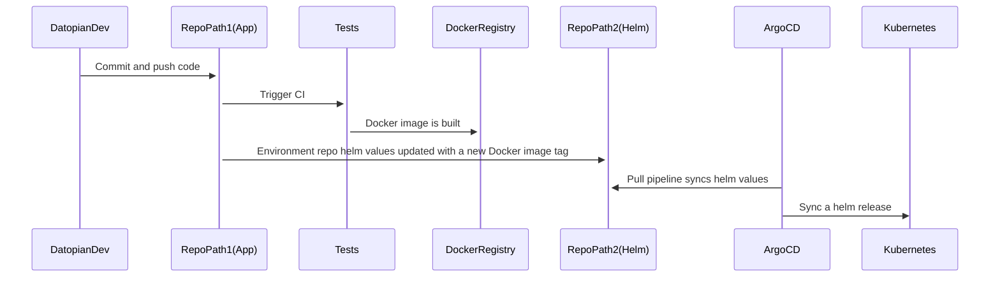

# DX Architecture

## Introduction

This document describes the target infrastructure and CI/CD pipeline architecture of CKAN Cloud on Kubernetes.

The proposed solution architecture is intended to be simple, automated and shouldn't require any kubernetes knowledge.

The core of the architecture is a DevOps toolchain following GitOps best practice. It is comprised of the following tools:

* Gitlab VCS
* Helm charts
* Gitlab CI push pipeline
* ArgoCD CD pull pipeline

ArgoCD is a new approach to deploy software, which follows GitOps best practice.

:::tip
If unfamiliar with GitOps please read the Appendix below.
:::

## Terminology

We follow ArgoCD terminology:

* Projects: an overall project containing one or more appplications/environments e.g. XYZ data portal
* Application: aka Instance/Environment e.g. production, staging, dev etc of XYZ data portal
* Service: a single microservice that is part of an Application

## Description of the CI/CD pipeline stages

1. Gitlab **Repo #1** (App repo): Source code is pushed to the CKAN repo
2. Gitlab **Repo #1** (App repo): CI build pipeline is triggered
3. Gitlab **Repo #1** (App repo): Unit tests, security scans, code quality and linters run
4. Gitlab **Repo #1** (App repo): Docker image is built
5. Gitlab **Repo #1** (App repo): Docker image is pushed to the Docker Registry
6. Gitlab **Repo #2** (Helm repo): Environment repository helm chart values file is updated
7. ArgoCD **Repo #2** (Helm repo): K8s manifests are synced with the helm environment **Repo #2**



## Deploying an Application 

1. Generate a Gitlab **Repo #1** (Application and Helm repository) by running a one-line command
A black-box for a developer (what happens under the hood):
    * **Repo #1** (App repo + Helm Repo) a project is initialized on Gitlab with a template project files
    * ArgoCD **Repo #2** (ArgoCD repo) config file is added with a new application to ArgoCD. From now on ArgoCD will sync **Repo #2** (Helm repo) with k8s
3. Push your code to **Repo #1** (App repo) and check your first deployment on k8s

### Project Repo Layout

Projects live inside the `deploys` group.

```
# create new repo on gitlab at datopian/applications/xxx
$ git clone that-repo
$ create-ckan-k8s-app --template XXX ...
$ tree

README.md        # optional
CREATE_CKAN_K8S_APP_VERSION
.gitlab-ci.yml
helm/
  templates/...
  values/...
service0-aka-ckan-core
  Dockerfile (if custom one needed)
service1      (if customization needed)
  Dockerfile
service2      # completely specific to this application
  code
  Dockerfile
```


## FAQs / TODOs

* How do we handle different "environments" (staging, production etc) of a given application?
  * ~~ANS: different branches~~
  * ~~ANS: different repos~~
  * ANS: different directories (or different `values.yml`)
    * When you create an application in ArgoCD you link it to a values.yml
  * TODO: What are the pros/cons of using branches vs "directory or file" approach
* What about automated "PRs" for new service releases e.g. i update frontend service and then get a PR on helm repo


## GitOps best practice

GitOps is a way of implementing Continuous Deployment for cloud native applications. It focuses on a **developer-centric experience** when operating infrastructure, by using tools developers are already familiar with, including Git and Continuous Deployment tools.

The core idea of GitOps is having a Git repository that always contains declarative descriptions of the infrastructure currently desired in the production environment and an automated process to make the production environment match the described state in the repository. If you want to deploy a new application or update an existing one, you only need to update the repository - the automated process handles everything else. It’s like having cruise control for managing your applications in production.

> GitOps: versioned CI/CD on top of declarative infrastructure. Stop scripting and start shipping.
> — Kelsey Hightower

### Architecture diagram for GitOps


### Architecture diagram for several environments


### What is Argo CD? (blue/green & canary deployment tool)

Argo CD is a declarative, GitOps continuous delivery tool for Kubernetes.

Application definitions, configurations, and environments should be declarative and version controlled. Application deployment and lifecycle management should be automated, auditable, and easy to understand.

Argo CD follows the GitOps pattern of using Git repositories as the source of truth for defining the desired application state. Kubernetes manifests can be specified in several ways:

* kustomize applications
* **helm charts**
* ksonnet applications
* jsonnet files
* Plain directory of YAML/json manifests
* Any custom config management tool configured as a config management plugin

Argo CD automates the deployment of the desired application states in the specified target environments. Application deployments can track updates to branches, tags, or pinned to a specific version of manifests at a Git commit. See tracking strategies for additional details about the different tracking strategies available.


Argo CD is implemented as a kubernetes controller which continuously monitors running applications and compares the current, live state against the desired target state (as specified in the Git repo). A deployed application whose live state deviates from the target state is considered OutOfSync. Argo CD reports & visualizes the differences, while providing facilities to automatically or manually sync the live state back to the desired target state. Any modifications made to the desired target state in the Git repo can be automatically applied and reflected in the specified target environments.

#### Features

* Automated deployment of applications to specified target environments
* Support for multiple config management/templating tools (Kustomize, Helm, Ksonnet, Jsonnet, plain-YAML)
* Ability to manage and deploy to multiple clusters
* SSO Integration (OIDC, OAuth2, LDAP, SAML 2.0, GitHub, GitLab, Microsoft, LinkedIn)
* Multi-tenancy and RBAC policies for authorization
* Rollback/Roll-anywhere to any application configuration committed in Git repository
* Health status analysis of application resources
* Automated configuration drift detection and visualization
* Automated or manual syncing of applications to its desired state
* Web UI which provides real-time view of application activity
* CLI for automation and CI integration
* Webhook integration (GitHub, BitBucket, GitLab)
* Access tokens for automation
* **PreSync, Sync, PostSync hooks to support complex application rollouts (e.g.blue/green & canary upgrades)**
* Audit trails for application events and API calls
* Prometheus metrics
* Parameter overrides for overriding ksonnet/helm parameters in Git

### References

* GitOps https://www.gitops.tech/
* ArgoCD https://argoproj.github.io/argo-cd/

