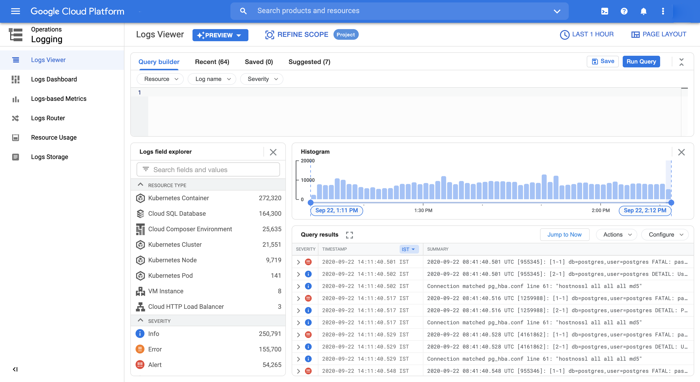
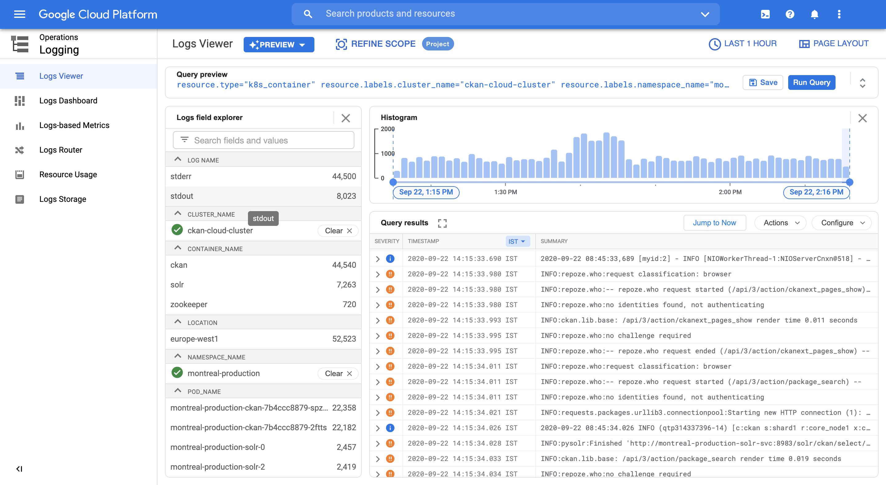
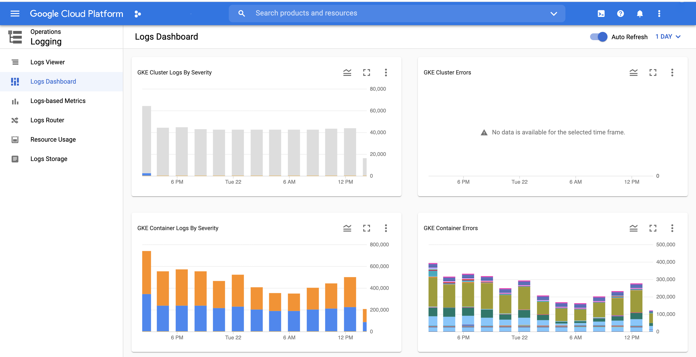

## Using Logging 

:::tip
This article is still under testing and development.
:::

## Application Logging

The Cluster Logging is by default enabled in the cluster and no separate action is needed to enable the persistence logging. But as the deployment is not done in the proper namespace and without a proper naming convention, it is getting messy and very difficult to filter out the logs for application and clusters. Also, there are too many logs generated by the frontend application which are redundant that need to be tidy up.

### Usage

Logging can be used by using the Logging service in the GCP. We need to select the filters for the namespace, container, application

### Below are the steps to use the logging:

1. Log into GCP
2. Select the project as `datopian-dx`
3. Go to Logging service

4. Add the query to the filters specific to the application. 
    - Using the query builder you can build your filter
    - You can write the filter also in the query e.g. 
    ```
    resource.type="k8s_container"     
    resource.labels.cluster_name="ckan-cloud-cluster" 
    resource.labels.namespace_name="xyz-production"
    resource.labels.container_name="frontend"
    ```

5. Please select the time you need logs for or it will give you runtime logs.
6. After applying the filters you'll get the logs.
7. You can save the filters so that you can just click on the filter and it will give you the result.


### Dashboard



## How To Improve It From Now On

1. Improve documentation.
