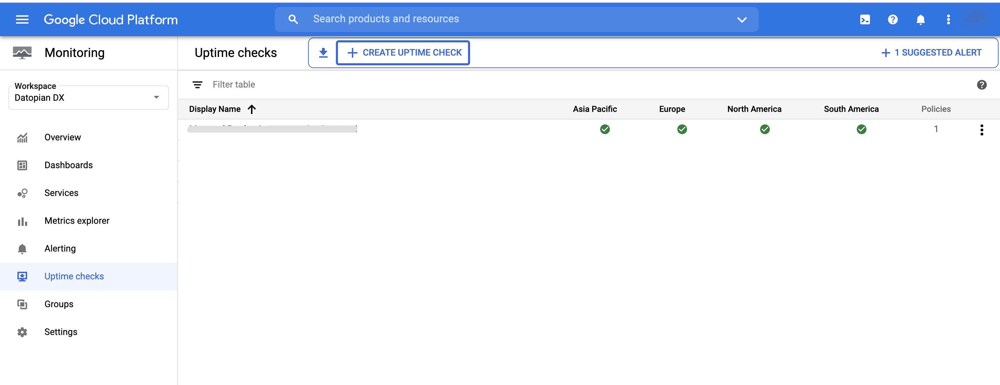
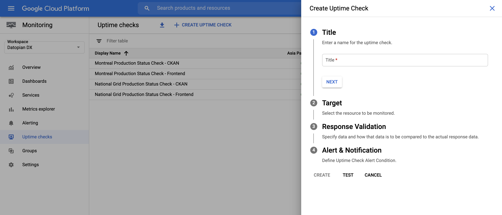
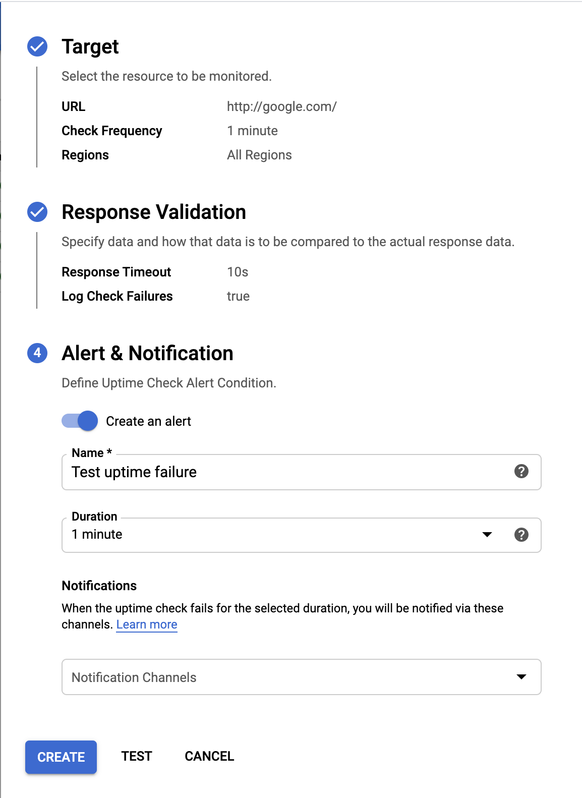
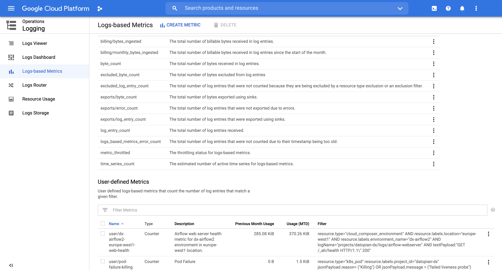
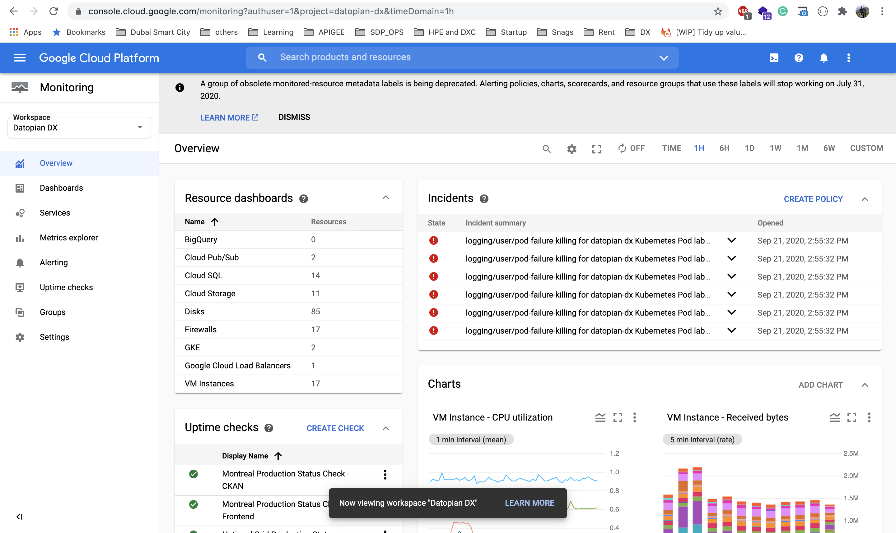

## Setting Up Monitoring and Alerts

:::tip
This article is still under testing and development.
:::

## Application Monitoring
Application Monitoring can be done in different ways like uptime check, pod health, liveliness, etc. Currently we are using the uptime check for the applications running in the cluster to validate application. We are using internal GCP Monitoring to monitor the application and setting up the alerts.

## Uptime Check and Alerts

### Steps to Create Uptime Check
1. Go to Google Console [Monitoring](https://console.cloud.google.com/monitoring/uptime?authuser=1&project=datopian-dx)


2. Click on `Create Uptime Check` from the top Menu
3. Add the title of the check.
    - `<Client> <Environment> Status Check - <Application>`
    - e.g `Montreal Production Status Check - CKAN`.


4. Add the URL of the application and path to validate the status like a health check URL. e.g `/api/3/action/status_show` for CKAN.


5. Set the response to validate if needed i.e. you can validate that the response for the health check URL also not only the status code.

6. Select the Notification Channel, so that if there is any issue with the application uptime notification will be triggered to that notification channel.

If the uptime is breached, there will be incident triggered, if the uptime is back automatically due to any reason, the incident will be auto closed with the information of downtime.


Otherwise, a member of the SRE needs to acknowledge the incident. Once acknowledged, he needs to add the comments and provide the reason and resolution of the incident and close the incident.

The incident will have the details about the incident and the downtime and the timestamps so that members can debug in logs.

## Custom Monitoring and Alerts

We can monitor the application on the based of logs also. 

1. Go to logging 

    - Create logging for the monitoring e.g.
     ```
     resource.type="k8s_pod"
     resource.labels.project_id="datopian-dx"
     jsonPayload.reason= ("Killing") OR jsonPayload.message =  ("failed liveness probe")
    ```
2. Click on Action and Create Metric. Now you have created a custom Metrics.
3. Go to Log-based Metrics and User-defined Metrics


4. Click on Create Alert from metrics.


## Dashboard



## References

* https://cloud.google.com/logging/docs/logs-based-metrics
* https://cloud.google.com/monitoring/docs


## How To Improve It From Now On

1. Improve documentation.
