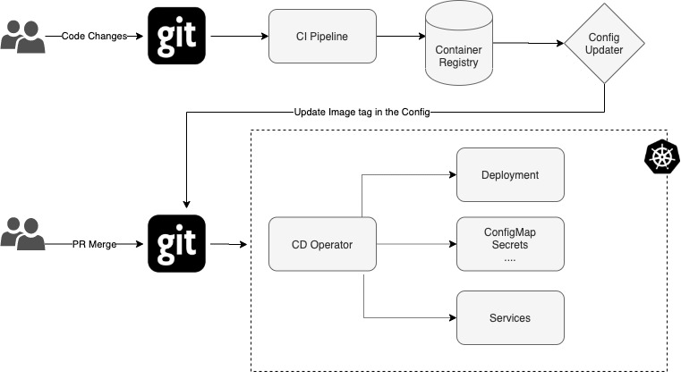
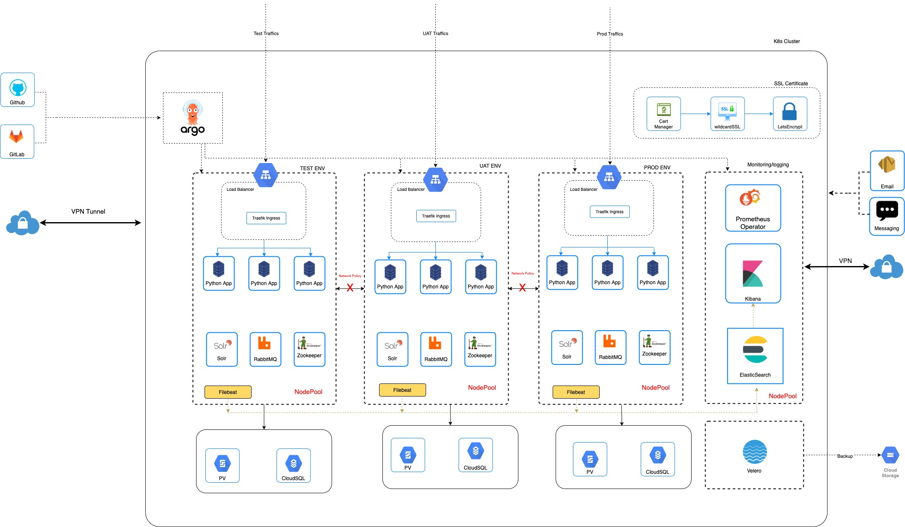

- **Feature Name: The Developer Experience (DX) approach**
- **Start Date: 2020-07-01)**
- **RFC PR:** [devops/pr](https://gitlab.com/datopian/tech/devops/-/merge_requests/5)
- **Tracking issue:** [devops/issue/140](https://gitlab.com/datopian/tech/devops/-/issues/140)

## Summary

Developer Experience (DX) is a set of practices covered around cloud native environments that give organizations and teams unified, cross-functional representation, shared accountability from development, operations, the business and everybody in between.

An operating model for DX provides a set of best practices that unify deployment, management and monitoring for containerized clusters and applications. A path towards a DX for managing applications; where end-to-end CICD pipelines and Git workflows are applied to both operations, and development.

## Motivation

Containers are the first class citizen in DX that plays instrumental roles in implementing microservice based environments. The motivation behind DX are far reaching and provide:

- Increased Productivity
- Higher Reliability and scalability
- Enhanced Developer Experience
- Consistency and Standardization

### The DX implementation offers:

- Automated CI/CD
- Secure Multi Tenancy
- Monitoring and Visualizations of ephemeral containers
- Horizontally Auto-Scalable Environments.
- Collecting, storing and analyzing Kubernetes telemetry data
- Reproducing for local development
- Backup, Restore and DR

## Guide-level explanation

### Automated CI/CD

DX Basic workflow implementation a well known GitOps pattern in Cloud Native approach. As depicted in the diagram, a user commits the code changes which trigger CI automation and upon PR merge CD process kicks in using ArgoCD Operator.

By Utilizing ArgoCD and Helm, the rollback requirement can be acahived.

### Managing multiple environments

DX utilizes the K8s Namespace for soft tenancy. DX has the ability to separate workloads in a granular way using namespaces . However, The namespace alone cannot guarantee isolation. DX utilizes advanced features of K8s to ensure the soft isolation is seamlessly achieved.

By utilizing the **Network Policies**, DX can enforce traffic rules between namespaces thus preventing any unauthorized network access across the environments.

Using tolerations, Node Affinity and Taints features, DX can ensure the worker nodes it creates are reserved (dedicated) for specific environment’s pods thus offering predictable performance.

DX can enforce the resource quota for the namespaces,Thus, Environment can access to more resources if desired.

### Cloud Native Monitoring

Monitoring ephemeral containers and clusters resources is one challenge microservices pose. By utilizing cloud native monitoring tools like Prometheus \[ [_https://prometheus.io/_](https://prometheus.io/) \] , we can collect metrics and set up a proactive alerting system. We can discover if all the nodes in the cluster are working properly and at what capacity, how many apps are running on each node, and the resource utilization of the entire cluster.

If we need to instrument the code, We can use the Prometheus client library. It helps engineers to expose a custom metric and let Prometheus collect and offer a better insight of the application's health.

There are a number of libraries and servers which help in exporting existing metrics from third-party systems as Prometheus metrics. For example, we can collect PostgreSQL, RabbitMQ, Redis metrics via the supported exporter. This leads us to gauge deep inside the applications and set up proactive alerting systems on the given thresholds. For available exporter, please refer: [_https://prometheus.io/docs/instrumenting/exporters/_](https://prometheus.io/docs/instrumenting/exporters/)

### Centralized Logging

Centralized logging is an essential component of any infrastructure that runs containerized workloads.Kubernetes doesn’t offer an easy way to find the correct log “files” on one of the many worker nodes in the cluster. The ephemeral container can be reschedule among different physical servers or cloud instances. Pod logs can be lost or, if a pod crashes, the logs may also get deleted from disk. Without a centralized logging solution, it is practically impossible to find a particular log file located somewhere on one of the hundreds or thousands of worker nodes. For this reason, any production-grade cluster should have its log collector agents (such as Filebeat) configured on all nodes as DaemonSet and use a centralized storage such as Elasticsearch for all log data.

Using Kibana \[ [_https://www.elastic.co/kibana_](https://www.elastic.co/kibana) \], We’ll be able to explore, analyze and visualize the logs and build a custom dashboard

### Secrets Encryption

Kubernetes has a built-in object for secret management, with the surprising name “Secret” however its no longer a secret. Its base64 encoded string. It is unsafe to push secrets in remote repositories. DX utilizes SealedSecret to Encrypt the application Secret into a SealedSecret, which is safe to store - even to a public repository. The SealedSecret can be decrypted only by the controller running in the target cluster.

[_https://github.com/bitnami-labs/sealed-secrets_](https://github.com/bitnami-labs/sealed-secrets)

### Backup, restore and DR

Every production environment should have Backup/Restore, Migration and DR strategies in place. Continuity planning is crucial in times of uncertainty . To help achieve Backup and DR planning, We can use Velero to perform full backups, backups of specific namespaces or resource types or schedule backups to execute them periodically. Some core features of Velero:

- It can take Backup of Kubernetes Resource
- Resource Backup can be stored in S3 or Google Storage.
- Periodic PV storage snapshot.
- Restore the backup of the given datetime.

[_https://velero.io/_](https://velero.io/)

## Detailed design

1.  This is Cloud agonistics design, tries to minimize the Vendor specific features.
2.  VPN is the only way to access K8s cluster and Services running in a private network. This includes the ArgoCD UI, Prometheus dashboard, grafana, kube-dashboard, and Kibana console.
3.  Namespace based on env names are created in their respective nodepool with applicable taints properties applied.
4.  Node affinity and tolerations properties are set in Env specific deployment manifest which will ensure that pods are not scheduled onto inappropriate nodes.
5.  Network Policy enforces the traffic rules between namespaces thus preventing any unauthorized access between the environments.
6.  Filebeat is a lightweight shipper for forwarding and centralizing log data. Installed as an agent (i.e Daemonset in each node)., It monitors the log files or locations that are specified, collects log events, parses logs using grok filter plugins and forwards them to Elasticsearch for indexing. Kibana is used for explore, analyze and visualizing the logs.
7.  Using Prometheus operator CRD, , we can collect metrics and set up a proactive alerting system. Alerts can be dispatched via Text message (via PageDuty or similar) or email or even using webhook.
8.  ArgoCD Events listens to GitHub or Gitlab repos changes and triggers the CI or CD actions. Preferably ArgoCD workloads will run in env specific nodes (i.e using Toleration, node affinity and nodeSelector).
9.  Each namespace (aka Environment) posses its own Publicly accessible Ingress LB, Ingress Routes, Certificates Secrets (issued by CertManager using Cloudflare provider), SealedSecrets (it uses asymmetric crypto to encrypt secrets that only the controller can decrypt).
10. Non-production env can share a single cloudSQL instance, however for best practices, each env has its dedicated CloudSQL. This is provisioned by dx-terraform and provisioned outside Kubernetes cluster.
11. Cert-Manager is installed and ClusterIssuer is created . It can issue certificates for each Namespace and can renew it as well. The Certs will be stored as TLS secrets and will be injected in the ingress controller.
12. Kubernetes RBAC will be utilized to restrict user access to one namespace. And Pods communication between namespace is prevented by Network Policy.
13. Velero will be used for Backup, restore and DR.

## Drawbacks

- **Implementation cost:**
  - Having a separate nodepool for each env could scale up the cost.
  - The design considers the ELK stack is part of the cluster, this can demand larger VM types with at least 16GB of memory. This can be offloaded to provider like logz, papertrail etc..
- **Prometheus monitoring:**
  - It is not suitable for storing event logs or individual events. Nor is it the best choice for high cardinality data, such as email addresses or usernames.
- **ElasticSearch**
  - Running stateful applications such as Elasticsearch as a microservice is not a trivial task because of how container orchestrators like Kubernetes treat the lifecycle of containers and pods. With careful strategies (using sidekick or [Operator](https://github.com/elastic/cloud-on-k8s)) and planning, stateful applications like ES can run and scale in the K8s.
- **CloudSQL Cost**
  - Running a CloudSQL instance for every environment will incur more cost. Ideal solution will be two CloudSQL instances; one shared among non-prod and the next for Production environment.

## Alternative Solutions

- **Cloud monitoring and Logging:**
  - The design stress on cloud agnostics solutions. However, with minimal cost we can achieve ELK-like features using GCP Operations (formerly known as Stackdriver)
  - logz.io is managed services for Unified log, metric and security analytics based on ELK and Grafana. There are cheaper options such as papertrail.
  - Promteheus and Grafana can be achieved using Monitoring provider such as [datadog](https://www.datadog.com) or [sysdig](https://www.sysdig.com)
- **CloudSQL:**
  - For non-production env, PostgreSQL can be run as StatefulSet or using[ Postgresql Operator](https://github.com/CrunchyData/postgres-operator)
- **Traefk Ingress:**
  - There are better alternatives for Traefk ingress controller, to name few: [Envoy](https://www.envoyproxy.io/), [Ambassador](https://www.getambassador.io/), [Istio](https://istio.io/), [Kong Ingress](https://konghq.com/kong/), [Nginx Ingress ](https://kubernetes.github.io/ingress-nginx/).
    > **NOTE** Istio, Ambassador and Kong are API Gateway.
