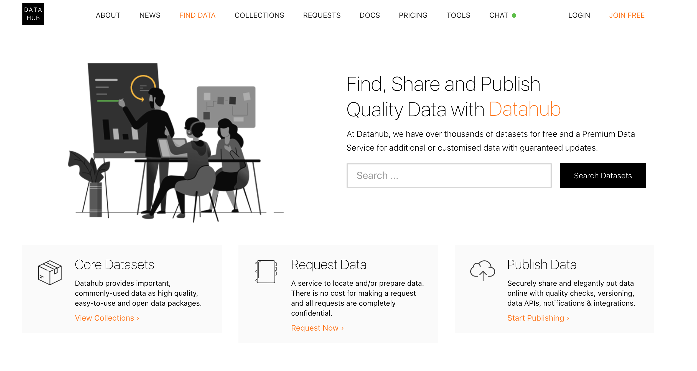
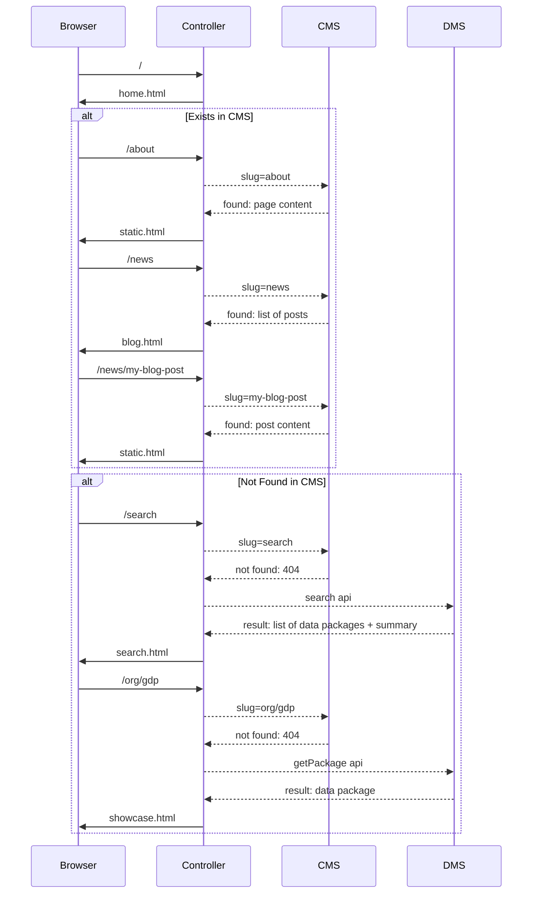

# Frontend

The (read) frontend component covers all of the traditional "read" frontend functionality of a data portal: front page, searching datasets, viewing datasets etc.

This page is primarily about the Next Gen approach to the Frontend, however we provide a brief overview of the Classic approach at the start.

## Features

* **Home Page** When visiting the data portal's home page, I want to see an overview of the portal (e.g. datasets) so that I understand if it's relevant for me.
* **Search/Browse the Catalog** When looking for dataset, I want to search for specific strings (keywords, topics etc.) so that I can find it quickly, if available.  
* **Dataset Showcase** When considering using a dataset I want to see a description and key information (title etc) and (if possible) data preview so that I understand what it contains and decide if I want to use it.
* **Organization and User Profiles**
* **Groups/Topics/Collections**
* **Custom additional pages**

Developer Experience

* Custom Home Page: When building a data portal home page I want to be able to customize it completely, integrating different widgets so that I have a great landing experience for users
* Theming (simple): **When working on a new site, I want to style it for the project so that it has a distintive look and feel aligned to the client's needs
* Rich customization (new routes, major page changes)
  * **When working on a data portal, I want to add frontend functionality to existing templates so that I can build upon past work and still extend the project to my own needs.**
  * When building up a new frontend I want to quickly add standard pages and components (and tweak them) so that I have a basic functional site quickly
* Use common languages and tooling: * **When working on a data portal, I want to build it using Javascript so that I can rely on the latest frontend technologies (frameworks/libraries).**
* Deploy quickly: **When delivering a data portal, I want to quickly and easily deploy changes to my frontend so that I can reduce the feedback loop.**

## CKAN Classic

The Frontend is implemented in the core app spread across various controllers, templates etc. For extending/theming a template, you have to write an extension (`ckanext-mysite`), and either override or inherit from the default files.

* Home page. The CKAN default template shows: Site title, Search element, The latest organizations, The latest groups. In order to change this, we need to create a CKAN extension and modify templates etc.
* Search/Browse the Catalog Already available in CKAN Classic (v2) with ability to search by facets etc., see an example here - https://demo.ckan.org/dataset
* Dataset Showcase. It is already available by default, for example:
  * Dataset page - https://demo.ckan.org/dataset/dataset_389383
  * Resource page - https://demo.ckan.org/dataset/dataset_389383/resource/331f57d1-74fc-46ad-9885-50eb26dde13a

In CKAN Classic we have a dataset (package) and resource pages:

- A dataset (package) page - this is where we can see summary of resources and package level metadata such as package title, description, license etc.
- A resource page - showcase of individual resource including views etc.

Links to source code:

- Package controller - https://github.com/ckan/ckan/blob/master/ckan/controllers/package.py
- Package view module - https://github.com/ckan/ckan/blob/master/ckan/views/dataset.py
- Resource view module - https://github.com/ckan/ckan/blob/master/ckan/views/resource.py
- Package and resource templates - https://github.com/ckan/ckan/tree/master/ckan/templates/package

### Developer Experience (DX)

Docs - https://docs.ckan.org/en/2.8/theming/index.html
* You need to do it in a new CKAN extension and follow recommended standards. There are no easy ways of reusing code from other projects, since most often they are not written in the required languages/frameworks/libraries.
* Nowdays, the best to do it is to create an extension for each of the components.
* There's no easy documented path for achieving this.
* The easier way is to deploy a complete CKAN v2 stack using Docker Compose.

- Theming - https://docs.ckan.org/en/2.8/theming/index.html
- Create new helper functions
https://docs.ckan.org/en/2.8/theming/templates.html#template-helper-functions

### Theming

Theming is done via CKAN Classic extensions. See https://docs.ckan.org/en/2.8/theming/index.html

### Extending (Plugins)

In CKAN Classic you extend the frontend e.g. adding new pages or altering existing ones by a) overriding templates b) creating an extension using specific plugin points (e.g. IController): https://docs.ckan.org/en/2.8/extensions/index.html

### Limitations

There are two main issues:

* There is no standard, satisfactory way to create data portals that integrates data and content. Current methods for integrating CMS content into CKAN are clunky and limited.
* Theming and frontend work is slow, painful and difficult for standard frontend ddvs because a) it requires installing and interacting with the full (complex) CKAN b) you use very specific frontend stack (python etc rather than javascript) c) template spaghetti (the curse of a million "slots") (did inheritance rather tha composition)
* There is too much coupling of frontend and backend e.g. logic layer doing dictize. Poor separation of concerns.

Here we're consolidating all challenges we have identified:

* Theming - styling, templating:
  * It uses Bootstrap 3 (out-dated). An upgrade takes significant amount of effort because all the existing themes rely, or may rely, on it.
  * No documented way of switching Bootstrap off and replace it for another framework.
  * Although the documentation only mentions pure CSS, CKAN also uses LESS. It's not clear how a theme could be written in LESS, if recommended or possible.
  * For changing or adding a better overview, one needs to create a CKAN extension, with its own challenges.
  * It needs to happen in Python/Jinja, overriding the exting actions and templates.
  * The main challenge is general theming in CKAN Classic, e.g., you have to follow the CKAN Classic way using inheritance model of templates.
* Javascript:
  * No viable way of extending it in other languages such as Javascript.
  * It's not simple to achieve the common task of adding Javascript to the frontend.
    * You must understand CKAN and a large portion of its architecture.
    * You must run CKAN in its entirety.
    * The document is far from short – https://github.com/ckan/ckan/blob/2.8/doc/theming/javascript.rst
    * Not (easily, at least) possible to develop a Single Page Application while still relying on CKAN for all the backend.

* Other:
  * It's not easy to make configuration changes to how the existing feature works.
  * The dataset URL follows a nested RESTFul format, with non-human readable IDs.
  * Not good for SEO.
  * It may be a reasonable default, but hardly works in practice as stakeholders have their own preferences.

## Next Gen

The default (read) frontend for Next Gen is written in NodeJS using ExpressJS.

For templating we use [Nunjucks][]. We chose Nunjucks because it is a Node port of Python's [Jinja2](http://jinja.pocoo.org/docs/) and Jinja2 is is the templating engine for CKAN Classic. Thus, using Nunjucks templating means templating is both familiar and existing Classic templates can be easily ported across.

[Nunjucks]: https://mozilla.github.io/nunjucks/templating.html

:::tip
Note: it is easy to write your own Next Gen frontend in any language or framework you like -- much like the frontend of a headless CMS site. And obviously you can still reuse the patterns (and even code if you are using JS) from the default approach presented here.
:::

## Installation

::: tip
Requires node.js v8.10.0 or later
:::

Clone the repo:

```bash
$ git clone https://github.com/datopian/frontend-v2.git
```

Install project dependencies:

```bash
$ cd frontend-v2
$ yarn # or you can use `npm i`
```

You can now run the frontend app in dev mode:

```bash
$ yarn dev # or `npm run dev`
```

Open a browser and navigate to http://localhost:4000. If everything went correctly you should see the *CKAN NG* frontend app!

> 

Now navigate to http://localhost:4000/search and you should see the data catalog - these are mocked at the moment. Let's now unmock it and use demo CKAN instance. To do that we need to change DMS API configuration. First stop the server and then run:

```bash
$ API_URL=http://demo.ckan.org/api/3/action/ yarn dev
```

Now you should see datasets from demo.ckan.org on your search page - http://localhost:4000/search.

Congratulations! You have a working data portal with live data backend!

## Theming

Changing the appearance of the site is easy and quick - we suggest starting with this [hello world tutorial](/frontend/theming/hello-world).

Next step would be to check out the docs about [how themes work](/frontend/theming/) in NG frontend.

## Set up your own backend

*By default, the frontend runs against mocked API so you don't need to setup your own backend.*

To change environment variables, you can rename `env.template` as `.env` and set the values. Here you can find more about configurations and how to set it up - [frontend configurations](/frontend/configs/).

### DMS

Setup `API_URL` environment variable so it points to your CKAN Classic instance, e.g., for demo.ckan.org it would be:

```
export API_URL=https://demo.ckan.org/api/3/action/
```

### CMS

You can use one of built-in CMS plugins - check it out below.

#### Wordpress

Read about WordPress plugin here: http://tech.datopian.com/frontend/plugins/#wp

#### CKAN Pages

Read about CKAN Pages plugin here: http://tech.datopian.com/frontend/plugins/#ckan-pages

## Extending (Plugins)

The frontend can be extended and customized. We saw in the [Hello World](/frontend/theming/hello-world/) section how we can use a custom theme to override site html using a views template.

In addition to html templates, you can add custom routes, additional middleware and more via plugins (and themes). Read more about this in the [Plugins section][plugins].

[plugins]: ./plugins/

### Themes vs Plugins

Themes and Plugins are actually very similar, for example you can create new routes or changes templates in both themes and plugins.

When do you want to create a theme and when a plugin?

* Plugins: functionality that applies to every request, regardless of what theme we are using.
* Themes: go for a theme if you are customizing the look and feel. You can also use the theme if you are e.g. adding routes and and you are just doing this for a single portal (and you don't intend to swap around between themes for this portal).

## Design - How it works

All of the controller and views MUST use the "API" modules, they don’t directly access the backend.

### API

We have separated API module into `DmsModel` and `CmsModel`. The former part talks to CKAN (or can be any DMS), while the latter fetches content for static pages, for example, it can be WordPress. Below is the flow of how it works together:



### Routes

Here is the summary of existing routes at the moment:

* Home: `/`
* Search: `/search`
  * with query: `/search?q=gdp`
* Showcase: `/organization/dataset`
* Organization: `/my_org`
  * It gets redirected from CKAN like path: `/organization/my_org`
* Collections: `/collections`
  * It gets redirected from CKAN groups page: `/group`
* CMS:
  * About: `/about`
  * Blog: `/news`
  * Post: `/news/my-post`
  * Anything else: `/foo/bar`

## Tests

Set `.env` to hit mocked services:

```bash
API_URL=http://127.0.0.1:5000/api/3/action/
WP_URL=http://127.0.0.1:6000
```

Run tests:
```bash
yarn test

# watch mode:
yarn test:watch
```

## Deployment

*You can deploy this app to any host that supports NodeJS.*

### Heroku

Read the docs about Deployment of NodeJS apps on Heroku - https://devcenter.heroku.com/articles/deploying-nodejs.

### Zeit Now

Read the docs - https://zeit.co/examples/nodejs

Suggested config file (`now.json`):

```json
{
  "version": 2,
  "builds": [
    {
      "src": "index.js",
      "use": "@now/node-server",
      "config": { "maxLambdaSize": "50mb" }
    }
  ],
  "env": {
    "NODE_ENV": "development"
  },
  "routes": [
    {
      "src": "/(.*)",
      "dest": "/index.js"
    }
  ]
}
```

<mermaid />

## Appendix

- [SCQH for Why Decoupled](/frontend/analysis/)
