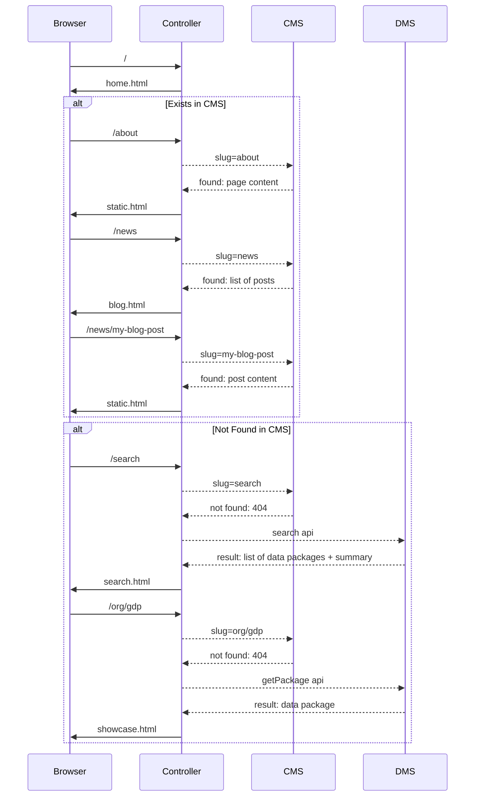

# Frontend

The (read) frontend component covers all of the traditional "read" frontend functionality of a data portal: front page, searching datasets, viewing datasets etc.

This page is primarily about the Next Gen approach to the Frontend, however we provide a brief overview of the Classic approach at the start.

## CKAN Classic

The Frontend is implemented in the core app spread across various controllers, templates etc.

### Theming

Theming is done via CKAN Classic extensions. See https://docs.ckan.org/en/2.8/theming/index.html

### Extending (Plugins)

In CKAN Classic you extend the frontend e.g. adding new pages or altering existing ones by creating an extension using specific plugin points (e.g. IController): https://docs.ckan.org/en/2.8/extensions/index.html


## Next Gen

The default (read) frontend for Next Gen is written in NodeJS using ExpressJS.

For templating we use [Nunjucks][]. We chose Nunjucks because it is a Node port of Python's [Jinja2](http://jinja.pocoo.org/docs/) and Jinja2 is is the templating engine for CKAN Classic. Thus, using Nunjucks templating means templating is both familiar and existing Classic templates can be easily ported across.

[Nunjucks]: https://mozilla.github.io/nunjucks/templating.html

:::tip
Note: it is easy to write your own Next Gen frontend in any language or framework you like -- much like the frontend of a headless CMS site. And obviously you can still reuse the patterns (and even code if you are using JS) from the default approach presented here.
:::

## Installation

::: tip
Requires node.js v8.10.0 or later
:::

Clone the repo:

```bash
$ git clone https://github.com/datopian/frontend-v2.git
```

Install project dependencies:

```bash
$ cd frontend-v2
$ yarn # or you can use `npm i`
```

You can now run the frontend app in dev mode:

```bash
$ yarn dev # or `npm run dev`
```

Open a browser and navigate to http://localhost:4000. If everything went correctly you should see the *CKAN NG* frontend app!

> 

Now navigate to http://localhost:4000/search and you should see the data catalog - these are mocked at the moment. Let's now unmock it and use demo CKAN instance. To do that we need to change DMS API configuration. First stop the server and then run:

```bash
$ API_URL=http://demo.ckan.org/api/3/action/ yarn dev
```

Now you should see datasets from demo.ckan.org on your search page - http://localhost:4000/search.

Congratulations! You have a working data portal with live data backend!

## Theming

Changing the appearance of the site is easy and quick - we suggest starting with this [hello world tutorial](/frontend/theming/hello-world).

Next step would be to check out the docs about [how themes work](/frontend/theming/) in NG frontend.

## Set up your own backend

*By default, the frontend runs against mocked API so you don't need to setup your own backend.*

To change environment variables, you can rename `env.template` as `.env` and set the values. Here you can find more about configurations and how to set it up - [frontend configurations](/frontend/configs/).

### DMS

Setup `API_URL` environment variable so it points to your CKAN Classic instance, e.g., for demo.ckan.org it would be:

```
export API_URL=https://demo.ckan.org/api/3/action/
```

### CMS

You can use one of built-in CMS plugins - check it out below.

#### Wordpress

Read about WordPress plugin here: http://tech.datopian.com/frontend/plugins/#wp

#### CKAN Pages

Read about CKAN Pages plugin here: http://tech.datopian.com/frontend/plugins/#ckan-pages

## Extending (Plugins)

The frontend can be extended and customized. We saw in the [Hello World](/frontend/theming/hello-world/) section how we can use a custom theme to override site html using a views template.

In addition to html templates, you can add custom routes, additional middleware and more via plugins (and themes). Read more about this in the [Plugins section][plugins].

[plugins]: ./plugins/

### Themes vs Plugins

Themes and Plugins are actually very similar, for example you can create new routes or changes templates in both themes and plugins.

When do you want to create a theme and when a plugin?

* Plugins: functionality that applies to every request, regardless of what theme we are using.
* Themes: go for a theme if you are customizing the look and feel. You can also use the theme if you are e.g. adding routes and and you are just doing this for a single portal (and you don't intend to swap around between themes for this portal).

## Design - How it works

All of the controller and views MUST use the "API" modules, they don’t directly access the backend.

### API

We have separated API module into `DmsModel` and `CmsModel`. The former part talks to CKAN (or can be any DMS), while the latter fetches content for static pages, for example, it can be WordPress. Below is the flow of how it works together:



### Routes

Here is the summary of existing routes at the moment:

* Home: `/`
* Search: `/search`
  * with query: `/search?q=gdp`
* Showcase: `/organization/dataset`
* Organization: `/my_org`
  * It gets redirected from CKAN like path: `/organization/my_org`
* Collections: `/collections`
  * It gets redirected from CKAN groups page: `/group`
* CMS:
  * About: `/about`
  * Blog: `/news`
  * Post: `/news/my-post`
  * Anything else: `/foo/bar`

## Tests

Set `.env` to hit mocked services:

```bash
API_URL=http://127.0.0.1:5000/api/3/action/
WP_URL=http://127.0.0.1:6000
```

Run tests:
```bash
yarn test

# watch mode:
yarn test:watch
```

## Deployment

*You can deploy this app to any host that supports NodeJS.*

### Heroku

Read the docs about Deployment of NodeJS apps on Heroku - https://devcenter.heroku.com/articles/deploying-nodejs.

### Zeit Now

Read the docs - https://zeit.co/examples/nodejs

Suggested config file (`now.json`):

```json
{
  "version": 2,
  "builds": [
    {
      "src": "index.js",
      "use": "@now/node-server",
      "config": { "maxLambdaSize": "50mb" }
    }
  ],
  "env": {
    "NODE_ENV": "development"
  },
  "routes": [
    {
      "src": "/(.*)",
      "dest": "/index.js"
    }
  ]
}
```

<mermaid />
