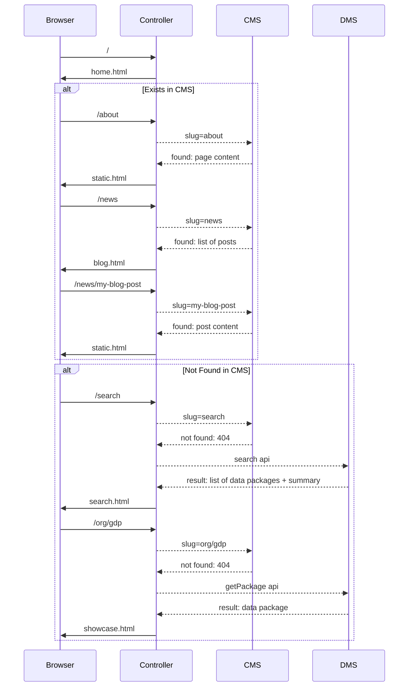

# Frontend

The frontend component covers all of the traditional "read" frontend functionality of a data portal: front page, searching datasets, viewing datasets etc.

## Installation

::: tip
Requires node.js v8.10.0 or later
:::

Clone the repo:

```bash
$ git clone https://github.com/datopian/frontend-v2.git
```

Install project dependencies:

```bash
$ cd frontend-v2
$ yarn # or you can use `npm i`
```

You can now run the frontend app in dev mode:

```bash
$ yarn dev # or `npm run dev`
```

Open a browser and navigate to http://localhost:4000. If everything went correctly you should see the *CKAN NG* frontend app!

> 

Now navigate to http://localhost:4000/search and you should see the data catalog - these are mocked at the moment. Let's now unmock it and use demo CKAN instance. To do that we need to change DMS API configuration. First stop the server and then run:

```bash
$ API_URL=http://demo.ckan.org/api/3/action/ yarn dev
```

Now you should see datasets from demo.ckan.org on your search page - http://localhost:4000/search.

Congratulations! You have a working data portal with live data backend!

## Theming

Changing the appearance of the site is easy and quick - we suggest starting with this [hello world tutorial](/frontend/theming/hello-world).

Next step would be to check out the docs about [how themes work](/frontend/theming/) in NG frontend.

## Set up your own backend

*By default, the frontend runs against mocked API so you don't need to setup your own backend.*

To change environment variables, you can rename `env.template` as `.env` and set the values. Here you can find more about configurations and how to set it up - [frontend configurations](/frontend/configs/).

### DMS

Setup `API_URL` environment variable so it points to your CKAN Classic instance, e.g., for demo.ckan.org it would be:

```
export API_URL=https://demo.ckan.org/api/3/action/
```

### CMS

You can use one of built-in CMS plugins - check it out below.

#### Wordpress

Read about WordPress plugin here: http://tech.datopian.com/frontend/plugins/#wp

#### CKAN Pages

Read about CKAN Pages plugin here: http://tech.datopian.com/frontend/plugins/#ckan-pages

## Extending frontend

The *CKAN Next Gen* frontend can be extended and customized. We saw in the [Hello World](/frontend/theming/hello-world/) section how we can use a custom theme to override site html using a views template. In addition to html templates, we can add custom routes and middleware via a theme or plugin. Below we explain more about plugins, if you would like to read about themes, please, follow [this link](/frontend/theming/).

### Plugins

In some cases we may want functionality that applies to every request, regardless of what theme we are using.

We can package such functionality as plugins.

There are currently two types of plugins: user-defined plugins which we add to the `/plugins` directory, and npm plugins, which we install via npm.

#### User-defined Plugins

Create a directory with the plugin's name in the `/plugins` directory.

```bash
$ mkdir plugins/addheader
```

Inside of this directory create a file called `index.js` with the following contents:

```javascript
module.exports = function(app) {
  app.use((req, res, next) => {
    res.header('x-my-custom-header', 1234)
    next()
  })
}
```

If you have worked with express middleware, you may recognize this pattern. For more on working with middleware in Express, see the docs [here](https://expressjs.com/en/guide/writing-middleware.html).

Add the plugin name to your `.env` file:

```
PLUGINS="addheader"
```

Run your application. Web responses from the frontend application should include your custom header.

#### NPM Plugins

If an express middleware plugin is available as a standalone module on npm you can install it as-is by installing the package via npm, and adding it to your PLUGINS variable in `.env`

For example, we will install the cookie-parser plugin, alongside our addheader plugin.

Install the npm package:
```
$ yarn add cookie-parser
```

Now add the plugins to your `.env`, alongside the custom `addheader` plugin we created above:
```
PLUGINS="addheader cookie-parser"
```

Cookie-parser will now be applied to all of your requests as express middleware!

(For instance, you could take advantage of this in custom routes, etc)

For more on express middleware: https://expressjs.com/en/guide/using-middleware.html.

#### Built-in plugins

When we worked in various projects, we started discovering that there are common things you need to develop. For example, most of the projects need a CMS solution (most commonly WordPress or CKAN Pages) or analytics system such as Google Analytics. So we've developed number of built-in plugins that you can use in your project and deliver features easily and reliably. Check out [this page](/frontend/plugins) for list of plugins and usage information.

## How frontend app works?

*All of the controller and views use the API module - they don’t see backend.*

### API

We have separated API module into `DmsModel` and `CmsModel`. The former part talks to CKAN (or can be any DMS), while the latter fetches content for static pages, for example, it can be WordPress. Below is the flow of how it works together:



### Routes

Here is the summary of existing routes at the moment:

* Home: `/`
* Search: `/search`
  * with query: `/search?q=gdp`
* Showcase: `/organization/dataset`
* Organization: `/my_org`
  * It gets redirected from CKAN like path: `/organization/my_org`
* Collections: `/collections`
  * It gets redirected from CKAN groups page: `/group`
* CMS:
  * About: `/about`
  * Blog: `/news`
  * Post: `/news/my-post`
  * Anything else: `/foo/bar`

## Tests

Set `.env` to hit mocked services:

```bash
API_URL=http://127.0.0.1:5000/api/3/action/
WP_URL=http://127.0.0.1:6000
```

Run tests:
```bash
yarn test

# watch mode:
yarn test:watch
```

## Deployment

*You can deploy this app to any host that supports NodeJS.*

### Heroku

Read the docs about Deployment of NodeJS apps on Heroku - https://devcenter.heroku.com/articles/deploying-nodejs.

### Zeit Now

Read the docs - https://zeit.co/examples/nodejs

Suggested config file (`now.json`):

```json
{
  "version": 2,
  "builds": [
    {
      "src": "index.js",
      "use": "@now/node-server",
      "config": { "maxLambdaSize": "50mb" }
    }
  ],
  "env": {
    "NODE_ENV": "development"
  },
  "routes": [
    {
      "src": "/(.*)",
      "dest": "/index.js"
    }
  ]
}
```

<mermaid />
