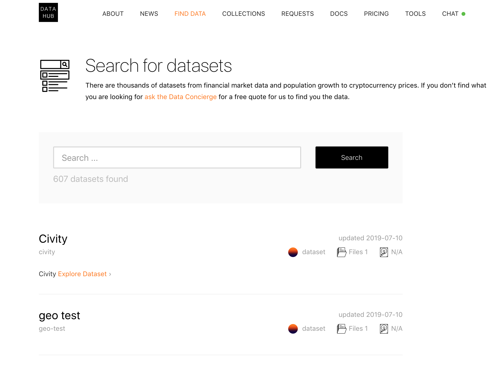
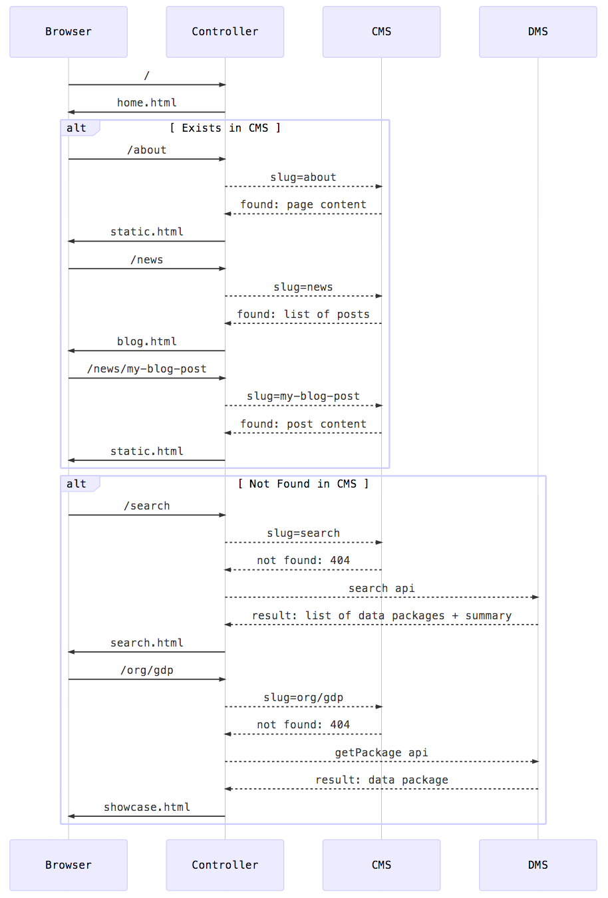

# CKAN Next Gen - Documentation

::: warning
#### These docs are a work in progress!  
[Leave comments](https://gitlab.com/datopian/ckan-next-gen/issues/3)
...or better yet [Submit a PR](https://gitlab.com/datopian/tech/kb)

Tag Paul Walker or Rufus for a review
:::

CKAN “Next Gen” (NG) is our name for the evolution of CKAN from its current state as “CKAN Classic”.

CKAN Next Gen will have a decoupled microservice architecture.

## Features / Highlights

* **Data catalog / portal** -- *CKAN NG* provides a clean and intuitive interface for managing and providing access to data catalogs on the web.
* **Data previews / downloads** -- Data can be easily previewed when browsing data catalogs.
* **Frictionless data & data packages** -- *NG* uses [Frictionless Data](https://frictionlessdata.io) to provide interoperability, portability, and security to data within our ecosystem.
* **Custom Content** -- It is simple to configure a backend for custom content, allowing site operators to continue using their 

## Installation 

::: tip
Requires node.js v8.10.0 or later
:::

Clone the frontend app

```bash
$ git clone https://github.com/datopian/frontend-v2.git
```

Use yarn or npm to install the project dependencies
```bash
$ cd frontend-v2
$ yarn install
```

Copy the environment settings to `.env`
```bash
$ cp env.template .env
```

Now edit `.env` so that it points to your *CKAN Classic* instance
(For this example we will use https://demo.ckan.org as our data backend)

After editing, your `.env` file should look like this:

```bash
PLUGINS=
WP_TOKEN=
NODE_ENV=development
THEME=example
TRANSLATIONS=
API_URL=https://demo.ckan.org/api/3/action/
WP_URL=http://127.0.0.1:6000

```

You can now run the frontend app

```
$ yarn start
```

Open a browser and navigate to `localhost:4000`

If everything went correctly you should see the *CKAN NG* frontend app!

> 

Now navigate to `localhost:4000/search`

You should see the data catalog from demo.ckan.org

> 


Congratulations! You have a working data portal!

## Hello world

Now we will use the `example` theme to provide a customization to the home page -- our "Hello World"!

(Not sure what a theme is? See the sections [theming](#themes) below)

In order to override the home page template we first need to copy it to the `views` folder of our `example` theme

```bash
$ cp views/home.html themes/example/views/
```

Use a text editor to edit the `themes/example/views/home.html` file and find the `<div>` containing the home page `<h1>` heading and replace the text so that it resembles the following:

`themes/example/home.html`
```html
            <div class="left-sec">
                <h1>Hello World</h1>
                <p>Hello world, how are you?</p>
```

And enable the theme in your `.env` file

`.env`
```
THEME=example
```

Save the file. The express should re-load automatically, and show you the update to the home page template.

> 

Congratulations!

## Installing CKAN Classic as Data backend

You can link your frontend to an existing *CKAN Classic* instance as [shown above](/#installation).

If you want to create a new *CKAN Classic* instance as a backend for CKAN, [see the instructions here](https://docs.ckan.org/en/2.8/maintaining/installing/).

To use the new backend, update your `.env` file to include the url to the ckan api, as follows:
```
API_URL=https:yoursite.com/api/3/action/
```

## Adding CMS

The *CKAN Next Gen* frontend currently integrates easily with wordpress. Just update the `.env` file in your frontend application directory to point to a publicly accessible wordpress site.

In your `.env` file:

```
WP_URL=https://blog.wordpress.org
```

If the API for the site is private, you can also enter add an access token to your config.

In your `.env` file:

```
WP_TOKEN=123abc
```

By default your wordpress posts will appear in the `/news` section of your CKAN site.

### Customizing your content
[@@TODO] 


## Ecosystem

### frontend-v2

*CKAN Next Gen* includes many changes. One major update is that the (read) “frontend” component is now a separate microservice.

The CKAN frontend communicates with a CMS and DMS [backend](/#backends) to deliver content:



The official NG frontend implementation is written in ExpressJS and is here: https://github.com/datopian/frontend-v2

You can easily write your own frontend service in any language or framework you like.


### CKAN Classic

*CKAN Classic* is the name for the current version (2.8) of CKAN.
The aim of the Frictionless Data spec is to provides a uniform specification for metadata and data as *Data Packages* and to provide a set of tools for working with Data Packagehe aim of the Frictionless Data spec is to provides a uniform specification for metadata and data as *Data Packages* and to provide a set of tools for working with Data Packages

*CKAN Classic* can be used as a backend for *CKAN NG*, a place to store and manage your data.
  
## Technical overview

### Frictionless Data

[Frictionless Data](https://frictionlessdata.io) is a collection of specifications and software for the publication, transport, and consumption of data. 

#### Data Packages

A Data Package consists of:

* Metadata that describes the structure and contents of the package
* Resources such as data files that form the contents of the package
* The Data Package metadata is stored in a "descriptor". This descriptor is what makes a collection of data a Data Package. The structure of this descriptor is the main content of the specification below.

*CKAN NG* uses [Data Packages](https://frictionlessdata.io/specs/data-package/) to manage data resources across the ecosystem.

#### Working with Data Packages

::: warning
It is important when working with data in *CKAN NG* to use the data packages format, and to use the appropriate tools.
:::

#### Javascript - data.js

[data.js](https://github.com/datopian/data.js) is a lightweight, standardized "stream-plus-metadata" interface for accessing files and datasets, especially tabular ones (CSV, Excel).

Internally, *CKAN NG* uses *data.js* to provide the tools needed to work with data packages.

#### Other languages

There are tools available for working with data packages in multiple languages and environments.

[See the exhaustive list of data package tools here](https://frictionlessdata.io/docs/)


# Technical Topics

## Extending Frontend

The *CKAN Next Gen* frontend can be extended and customized. We saw in the [Hello World] section how we can use a custom theme to override site html using a views template. In addition to html templates, we can add custom routes and middleware via a custom theme. 

### Themes

To add a theme, create a folder in the `/themes` directory. At very least you must add a `index.js` file with the following code in it:

```javascript
module.exports = function (app) {
  // no-ops
}

```

The app object is the express app. We can extend this object to add routes to our application, to provide middleware layers, or to do anything that express allows us to do. 

For instance, we can add a custom route with a simple message:

```javascript
module.exports = function (app) {
  app.get('/hello', (req, res) => {
    console.log('example route')
    res.render('example.html', {
      title: 'Example Theme route',
      content: {hello: 'Hello from my theme!'}
    })  
  })  
}
```

If you have worked with Express.js, this will look quite familiar. For more on working with Express.js, see the [complete documentation here](https://expressjs.com/en/5x/api.html).

Note that the first argument to the `res.render` function is the name of a template. We can define this template in our themes folder at `themes/mytheme/views/example.html`:

```html


dash

<div class="pt-6">
    {{ content.foo }}
</div>

```

For a complete guide to theming, see [below](#themes)

#### NPM Themes

Themes can be loaded via npm:

```
$ yarn add your_ckan_ng_theme
```

And in `.env`
```
THEME=your_ckan_ng_theme
THEME_DIR=node_modules
```

> *NOTE*: Make sure to set `THEME_DIR` to `node_modules`!!!

### Plugins

In some cases we may want functionality that applies to every request, regardless of what theme we are using. 

We can package such functionality as plugins. 

There are currently two types of plugins: user-defined plugins which we add to the `/plugins` directory, and npm plugins, which we install via npm.

#### User-defined Plugins

Create a directory with the plugin's name in the `/plugins` directory.

```bash
$ mkdir plugins/addheader
```

Inside of this directory create a file called index.js with the following contents:


```javascript
module.exports = function(app) {
  app.use((req, res, next) => {
    res.header('x-my-custom-header', 1234)
    next()
  })
}
```

If you have worked with express middleware, you may recognize this pattern. For more on working with middleware in Express, see the docs [here](https://expressjs.com/en/guide/writing-middleware.html).

Add the plugin name to your `.env` file:

```
PLUGINS="addheader"
```

Run your application. Web responses from the frontend application should include your custom header.

#### NPM Plugins

If an express middleware plugin is available as a standalone module on npm you can install it as-is by installing the package via npm, and adding it to your PLUGINS variable in `.env`

For example, we will install the cookie-parser plugin, alongside our addheader plugin.

Install the npm package: 
```
$ yarn add cookie-parser
```

Now add the plugins to your `.env`, alongside the custom `addheader` plugin we created above: 
```
PLUGINS="addheader cookie-parser"
```

Cookie-parser will now be applied to all of your requests as express middleware!

(For instance, you could take advantage of this in custom routes, etc)

For more on express middleware: https://expressjs.com/en/guide/using-middleware.html

### Backends
* DMS -- The Data Management System used by *CKAN NG*
Currently the only supported DMS Backend is *CKAN Classic* (CKAN <= v2.8) but there is no reason why additional integrations cannot be included. Stay tuned!

* CMS -- The Content Management System used by *CKAN NG*
Currently the only supported CMS Backend is Wordpress but there is nothing stopping us / you from writing integrations to additional Content Management Systems. Stay tuned!

## Theming (from frontend-v2 README)

See the [frontend docs](https://github.com/datopian/frontend-v2#theming) for an in-depth discussion of theming.

See the frontend docs for an in-depth discussion of theming: https://github.com/datopian/frontend-v2#theming
