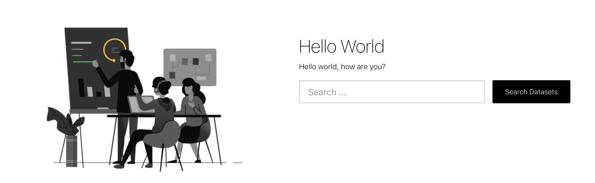

# Theming frontend

## Hello world!

We've prepared an `example` theme (located in `./themes/` directory) that you can use to get started with theming frontend app. Let's customize the home page -- our "Hello World"!

Enable the theme in your `.env` file (read more about configs [here](/frontend/configs/)):

```
THEME=example
```

In order to override the home page template we first need to copy it to the `views` folder of our `example` theme

```bash
$ cp views/home.html themes/example/views/
```

Use a text editor to edit the `themes/example/views/home.html` file and find the `<div>` containing the home page `<h1>` heading and replace the text so that it resembles the following:

```html
<div class="left-sec">
  <h1>Hello World</h1>
  <p>Hello world, how are you?</p>
```

Save the file. If you're running the app in dev mode, it should re-load automatically, and show you the update to the home page template.

> 

Congratulations!

## Theme distribution and installation

We recommend either having your theme in a git repository or publish it to NPM.

### Theme is in a git repo

If your theme is not published to NPM but it is available in a git repo, you can install it from there:

```bash
# From gitlab repo and datopian org:
$ yarn add git+https://git@gitlab.com/datopian/repo-name.git

# From github repo and datopian org:
$ yarn add git+https://git@github.com/datopian/repo-name.git
```

### Theme is on NPM

If the theme is on NPM you can install it as a regular NPM package:

```bash
$ yarn add my-theme-name
```

### Enable it

Once you've installed the theme, you need to enable it via `.env` config file:

```
THEME=my-theme-name
```

Done! Start the server and checkout how your theme looks like :wave:
