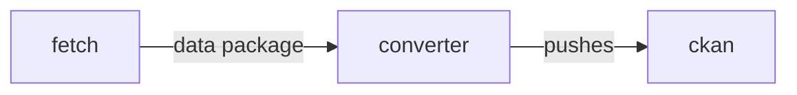
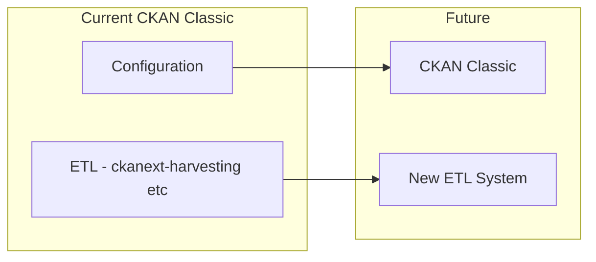
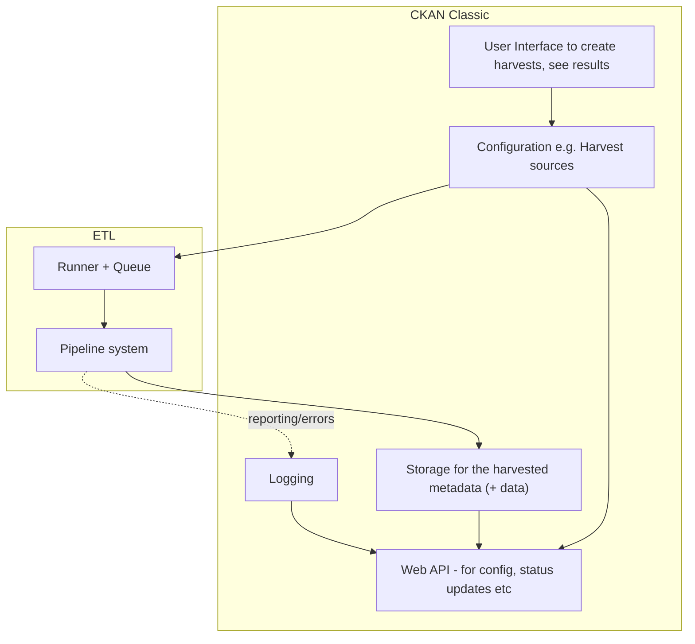
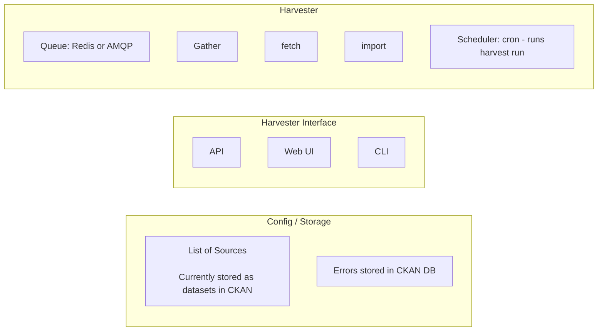
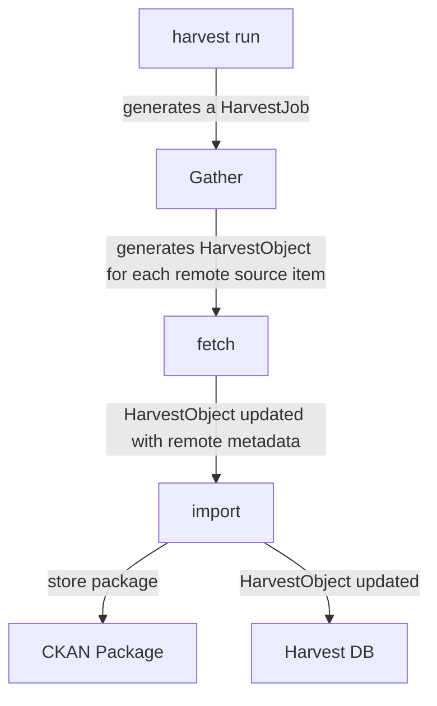

# Harvesting

Harvesting is the automated collection into a CKAN instance of metadata (and maybe data) from other catalogs and sources.

As X I want to harvest datasets' metadata (and maybe data) into one CKAN instance from other catalogs so that all the metadata is in one place (and hence searchable there)

Desired features include:

* Easily create and maintain harvesters
* Off-the-shelf harvesting for common metadata formats
* Create and update harvest sources via API and UI
* Run and view harvests via API
* Logging and monitoring
* Robust and reliable performance
* Scalabiliity: support harvesting thousands or even millions of datasets a day

## How does CKAN Classic do harvesting?

It uses [ckanext-harvest](https://github.com/ckan/ckanext-harvest). The core of this is storing configuration into the main DB and running harvesters off a queue process.

A detailed analysis of how it works is in the appendix below.

### Limitations 

The main critique is that ckanext-harvest builds a full mini-ETL system into CKAN.

Good: Using CKAN as metadata (config) store and having a UI for that

Not so good:

* An ETL system integrated with CKAN
  * Tightly coupled: so running tests of ETL requires CKAN (with result that many harvests have few or no tests)
  * Installation is painful (CKAN + 6 steps)
  * Dependent on CKAN upgrade cycles (tied via code rather than service API)
  * CKAN is more complex
  * Runner is bespoke to CKAN rather than using something standard like e.g. AirFlow
* Logging and reporting is not great and hard to customize (logs into CKAN)
* Rigid structure (gather, fetch, import) which may not fit many situations e.g. data.json harvesting (one big file with many datasets where everything done in gather) or where dependencies between stages
* Maintenance Status - Some maintenance but not super it looks like but quite a lot outstanding (as of Aug 2019):
  * 47 [open issues](https://github.com/ckan/ckanext-harvest/issues)
  * 6 [open pull requests](https://github.com/ckan/ckanext-harvest/pulls) (some over a year old)
 

## Next Gen Harvesting

Next Gen harvesting decouples the core "ETL" part of harvesting into a small, self-contained microservice that is runnable on its own and communicates with the rest of CKAN over APIs. This is consistent with the general [next gen microservice approach](/next-gen/).

The design allows the Next Gen Harvester to be used with both CKAN Classic and CKAN Next Gen.

### Features

* Simple: Easy to write harvesters -- just a python script
* Runnable and testable standalone (without the rest of CKAN)
* Testing is much easier 
* Uses the latest standard ETL techniques and technologies
* Data Package based

### Installation

CKAN Next Gen is in active development and is being deployed in production.

You can find the code here:

https://gitlab.com/datopian/ckan-ng-harvester-core

### Run it standalone

TODO

### Test File to be set up correctly

TODO

### Here’s you integrate it with CKAN Classic

TODO


## Harvester Architecture

### Harvesting is ETL

"Harvesting" of metadata in its essence is exactly the same as any data collection and transformation process ("ETL"). "metadata" is no different from any other data for our purposes (it is just quite small!).

This insight allows us to see harvesting as just like any other ETL process. At the same time, the specific nature of *this* ETL process e.g. that it is about collecting dataset metadata, allows us to design the system in specific ways.

We can use standard ETL tools to do harvesting, loosely coupling their operation to the CKAN Classic (or CKAN Next Gen) metastore. 

### Key Components

Harvesting as consists of the following key components:

* **Configuration** e.g. of harvest sources (including UI and API for this)
* **Pipelines** to do the harvesting of the metadata
* **Runner**
* **Logging**
* **Storage**
  * Final storage for harvested metadata -- this is considered to be outside the harvesting system itself
  * Intermediate storage for temporary or partial outputs

### Pipelines

The key steps in a harvesting pipeline (may not even need these stages separated)



### Principles

All "fetchers" produce data packages 


## Appendix: Hybrid Harvesting: Evolving CKAN Classic

 Config in CKAN MetaStore, ETL in new System

* Keep storage and config in CKAN MetaStore (e.g. CKAN Classic)
* New ETL system for the actual harvesting process



More detailed version:




## Appendix: CKAN Classic Harvesting in Detail

https://github.com/ckan/ckanext-harvest

README is excellent and def worth reading - key parts of that are also below.


### Analysis - How it works

Domain model - [Here](https://github.com/ckan/ckanext-harvest/blob/master/ckanext/harvest/model/__init__.py)

* HarvestSource - a remote source for harvesting datasets from e.g. a CSW server or CKAN instance 
* HarvestJob - a job to do the harvesting (done in 2 stages: gather and then fetch and import). This is basically state for the overall process of doing a harvest.
* HarvestObject - job to harvest one dataset. Also holds dataset on the remote instance (id / url)
* HarvestGatherError
* HarvestObjectError
* HarvestLog



0. *Harvest run:* a regular run of the Harvester that generates a HarvestJob object. This is then passed to gather stage. This is what is generated by cron `harvest run` execution (or from web UI)
1.  The **gather** stage compiles all the resource identifiers that need to be fetched in the next stage (e.g. in a CSW server, it will perform a GetRecords operation).
2.  The **fetch** stage gets the contents of the remote objects and stores them in the database (e.g. in a CSW server, it will perform an GetRecordById operations).
3.  The **import** stage performs any necessary actions on the fetched resource (generally creating a CKAN package, but it can be anything the extension needs).



```python
def gather_stage(self, harvest_job):
    '''
    The gather stage will receive a HarvestJob object and will be
    responsible for:
        - gathering all the necessary objects to fetch on a later.
          stage (e.g. for a CSW server, perform a GetRecords request)
        - creating the necessary HarvestObjects in the database, specifying
          the guid and a reference to its job. The HarvestObjects need a
          reference date with the last modified date for the resource, this
          may need to be set in a different stage depending on the type of
          source.
        - creating and storing any suitable HarvestGatherErrors that may
          occur.
        - returning a list with all the ids of the created HarvestObjects.
        - to abort the harvest, create a HarvestGatherError and raise an
          exception. Any created HarvestObjects will be deleted.

    :param harvest_job: HarvestJob object
    :returns: A list of HarvestObject ids
    '''

def fetch_stage(self, harvest_object):
    '''
    The fetch stage will receive a HarvestObject object and will be
    responsible for:
        - getting the contents of the remote object (e.g. for a CSW server,
          perform a GetRecordById request).
        - saving the content in the provided HarvestObject.
        - creating and storing any suitable HarvestObjectErrors that may
          occur.
        - returning True if everything is ok (ie the object should now be
          imported), "unchanged" if the object didn't need harvesting after
          all (ie no error, but don't continue to import stage) or False if
          there were errors.

    :param harvest_object: HarvestObject object
    :returns: True if successful, 'unchanged' if nothing to import after
              all, False if not successful
    '''

def import_stage(self, harvest_object):
    '''
    The import stage will receive a HarvestObject object and will be
    responsible for:
        - performing any necessary action with the fetched object (e.g.
          create, update or delete a CKAN package).
          Note: if this stage creates or updates a package, a reference
          to the package should be added to the HarvestObject.
        - setting the HarvestObject.package (if there is one)
        - setting the HarvestObject.current for this harvest:
           - True if successfully created/updated
           - False if successfully deleted
        - setting HarvestObject.current to False for previous harvest
          objects of this harvest source if the action was successful.
        - creating and storing any suitable HarvestObjectErrors that may
          occur.
        - creating the HarvestObject - Package relation (if necessary)
        - returning True if the action was done, "unchanged" if the object
          didn't need harvesting after all or False if there were errors.

    NB You can run this stage repeatedly using 'paster harvest import'.

    :param harvest_object: HarvestObject object
    :returns: True if the action was done, "unchanged" if the object didn't
              need harvesting after all or False if there were errors.
    '''
```

### Features

* Redis and AMQP (does anyone use AMQP)
* Logs to database with API access (off by default) - https://github.com/ckan/ckanext-harvest#database-logger-configurationoptional
* Dataset name generation (to avoid overwriting)
* Send mail when harvesting fails
* CLI - https://github.com/ckan/ckanext-harvest#command-line-interface
* Authorization - https://github.com/ckan/ckanext-harvest#authorization
* Built in CKAN harvester - https://github.com/ckan/ckanext-harvest#the-ckan-harvester
* Running it: you run the queue listeners (gather )

Existing harvesters

* CKAN - ckanext-harvest
* DCAT - https://github.com/ckan/ckanext-dcat/tree/master/ckanext/dcat/harvesters
* Spatial - https://github.com/ckan/ckanext-spatial/tree/master/ckanext/spatial/harvesters

