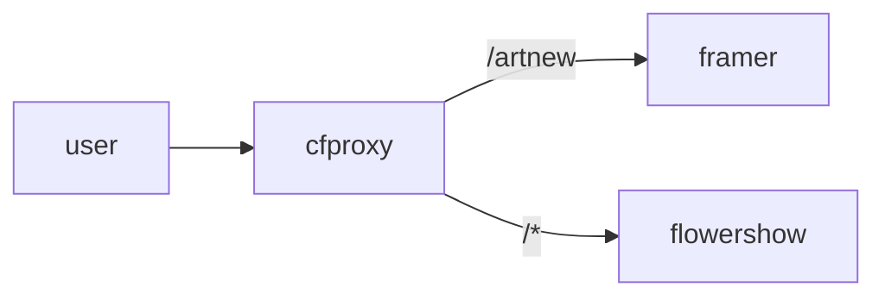

# How-to create a reverse proxy to any other domain with Cloudflare workers

Why would you want this you may ask?

- Sometimes you can't change the downstream domain (or it costs money! e.g. on notion sites or elsewhere)
- Sometimes you want to take content from 2 different sites and merge them onto one domain

## Simple version - just proxy everything (on this route) to another domain

1. Create a new worker (can use hello world)
2. Update it with reverse proxy code (below)
3. Add the route matching you want in the Cloudflare worker routes for your chosen domain


### Reverse proxy code

```javascript
addEventListener('fetch', function(event) {
  event.respondWith(handleRequest(event.request))
})

const proxySite = 'https://flowershow.app/'

async function handleRequest(request) {
  const { pathname } = new URL(request.url)
  // Only GET requests work with this proxy.
  if (request.method !== 'GET') return MethodNotAllowed(request)

  // we don't need to do the route matching here as we do it in cloudflare dashboard
  // much more efficient as only use worker when we have to
  //Proxy Blog and Static assets
  // if (pathname == '' || pathname =='/' || pathname.startsWith("/blog") || pathname.startsWith("/_next") || pathname.startsWith('/static/img/next/') || pathname.startsWith('/data-literate-demo')) {
  //      return fetch(`https://next.datahub.io${pathname}`)
  // } else {
  //  return fetch(`https://datahub.io${pathname}`)
  // }

  return fetch(`${proxySite}${pathname}`)
}

function MethodNotAllowed(request) {
  return new Response(`Method ${request.method} not allowed.`, {
    status: 405,
    headers: {
      'Allow': 'GET'
    }
  })
}
```

### Setup worker route


## More elaborate: use cloudflare to combine two distinct backend sites into one url space.

Here i want to combine two sites together. For example, a framer website for some pages and a [Flowershow](https://flowershow.app/) website for other pages.



### Reverse proxy code for 2 sites

```javascript
addEventListener('fetch', function(event) {
  event.respondWith(handleRequest(event.request))
})

const proxySite = 'https://2r.framer.website'
const flowershowSite = 'https://ecosystem-7yh.pages.dev'

async function handleRequest(request) {
  const { pathname } = new URL(request.url)
  // Only GET requests work with this proxy.
  if (request.method !== 'GET') return MethodNotAllowed(request)

  //Proxy various things to 
  if (pathname == '' || pathname =='/'
    || pathname == '/paper'
    || pathname == '/course'
    || pathname == '/newsletter'
    || pathname.startsWith('/about')
    || pathname.startsWith("/art")
    || pathname == "/ecosystem"
    ) {
    return fetch(`${proxySite}${pathname}`)
  } else {
    return fetch(`${flowershowSite}${pathname}`)
  }

  // return fetch(`${proxySite}${pathname}`)
}

function MethodNotAllowed(request) {
  return new Response(`Method ${request.method} not allowed.`, {
    status: 405,
    headers: {
      'Allow': 'GET'
    }
  })
}
```
