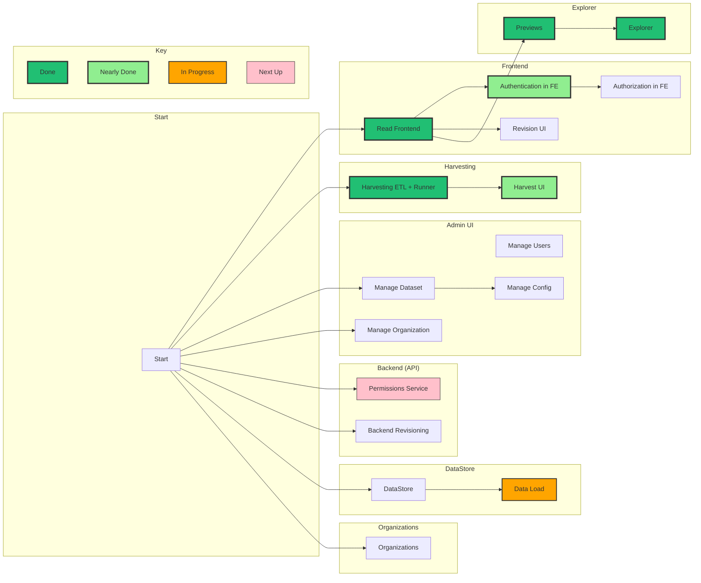

# Roadmap for "Next Gen"

Here's an overview of the implementation status of CKAN Next Gen. More granular information on particular features may sometimes be found on the individual feature page, for example for [Harvesting here](/harvesting/#design).

<mermaid />

