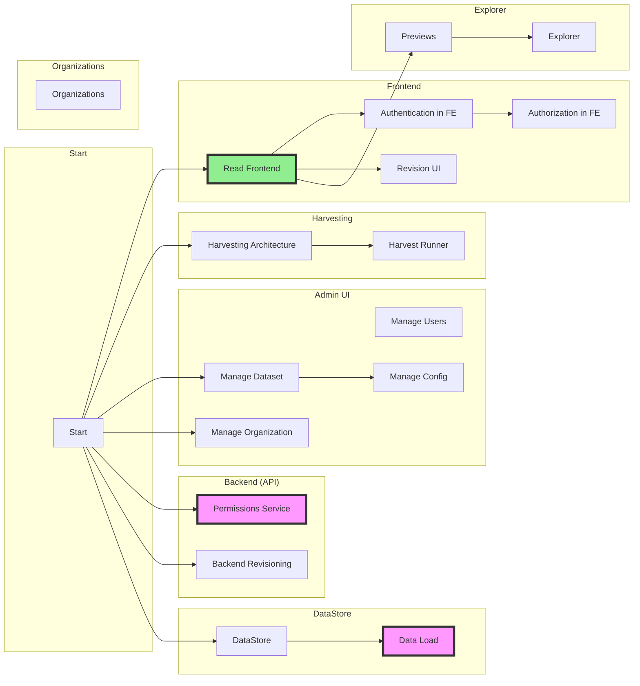

# Roadmap for "Next Gen"

Summary

* [x] Frontend (against Classic)
* [ ] Harvesting (in progress)
* [ ] DataLoad for DataStore (similar to DataLoad)
* [ ] DataStore
* [ ] Explorer
  * [ ] Views as a backend object (with permissions)
  * [ ] Admin UI for Views ...
    * [ ] GeoViews
    * [ ] Charts ...
* [ ] Admin UI ...
  * [ ] Import a Dataset ...
  * [ ] ...

<mermaid />

