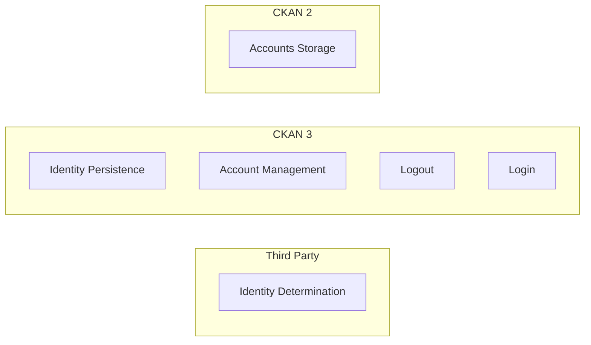

# Permissions (Authentication and Authorization)

As a Data Portal Owner I want only authenticated and authorized users to view (e.g. my staff), to edit (specific groups) so that we can put data in the portal and know that only appropriate people can use and contribute

* Access to data is only to those we have authorized (and we don't give access to public or competitors unless we choose to!)
* we don't disclose information inappropriately internally (e.g. info with privacy restrictions)
* People don't accidentally edit others datasets

Permissions breaks down into two parts:

* Authentication: who are you?
* Authorization: what can you do? => much bigger

## Authorization

As a Dataset Owner I want to be able to limit access, editing etc to my datasets at several levels and using org/teams and potentially other mechanisms so that I can easily comply with PII restrictions whilst making my data as widely available as possible and enabling collaborators to contribute easily

### Differentiating Metadata and Data Access

As a Dataset Owner I want to allow viewing of the dataset metadata including the list of resources whilst limiting access to the data itself (e.g. restricting download) so that I can allow others to discover the data i have (and request access) whilst complying with restrictions on data access (e.g. PII)

* TODO: what about *pre*viewing?

### Editing Controls

As a Dataset Owner I want to restrict those who can edit my dataset so that only those I authorize can edit the dataset

* I probably want to do this in bulk e.g. add my whole organization/team

### Update Permissions

As a Dataset Owner I want to control who has the ability to change permisssions on my dataset so that only people i choose can do this ...

* Default would be e.g. Dataset Owner + Org Admin can do this ...
* Are other options desired / possible?

### Private Datasets

As a Dataset Owner I want to make a dataset "private" so that it is only visible to those who have "edit" access on the dataset and is invisible to everyone else

### Adding one-off collaborators

As a Dataset Owner I want to add someone outside of my organization to a restricted dataset so they can collaborate and review

### Differential resource access restrictions

As a Dataset Owner I want to grant different levels of access to resources in a dataset so that I can make some resources private and others public (because maybe one resource contains PII)

### I want to reuse the team/org structure already in LDAP

As an Org/Team manager I don't want to have to add everyone in my team again in CKAN when i have this already in LDAP so that I save time and avoid risk things go out of sync

### Not Permissions (?)

#### Pre-Release Limits on Datasets

As a Dataset Owner (?? maybe someone else) I want to have a workflow for reviewing datasets before they go "public" so that they are a) in a good quality state b) are compliant with any regulations (e.g. around PII)

TODO: Is this really related to permissions?? Seems a broader issue ...

## Authentication

The core function of authentication is to **Identify** Users of the Portal (in a federated way) so we can base access on their identity.

There are 3 major conceptual components: Identity, Accounts and Sessions which come together in the following stages:

* Root Identity Determination: Determine Identity often via Delegation
* Sessions: Persistence of the identity in the web application in a secure way (without new identity determination on each request! I don't want to have to login via third party service every time)
* Account: Storing Related Account/Profile Information in our application (not in third party identity) eg. email, name (other preferences)
  * This will get auto-created usually at first Identification
  * In limited case this can be seen as a cache of info from Identity system (e.g. your email) 
  * However often richer info that is app specific that is generated (relevant for personalization)

### Job Story

As a Data Portal Owner I want to know the identity of those using the portal (to view, to edit) so that i can limit access and editing based on who they are

* I want to do this via an existing SSO method e.g. LDAP

As a User I want to use my existing credentials for login so that I don't have to sign up one more time (i have a very simple sign in flow)

* Also reduces security issues (don't have to share yet another password)

> TODO - is this a use case we ever want to support ...
>
> As a Portal Owner I want to have some people login via LDAP and some people sign up directly so that i can use my org login system alongside having others signup and login

### Account and Session Management

* Log out: DePersisting the Session
* Invalidating all Sessions: e.g. if a security issue
* Deleting an Account (Access)
* Updating the account (and its access control)
* Resetting password is only if local password management

### CKAN 2 to CKAN 3

How does this conceptual framework map to an evolution of CKAN 2 to CKAN 3?

Questions

* Does CKAN Classic allow us to store arbitrary account information (are there "extras")
* How would we avoid having to support identity persistence, delegation etc in both NG frontend and Classic Admin UI?
  * Can we share cookies (e.g. via using subdomains)
* How is login, identity determination etc done at least for frontend in DataHub.io
* Should account UI really be in NG frontned vs Classic Admin UI?

<mermaid />

