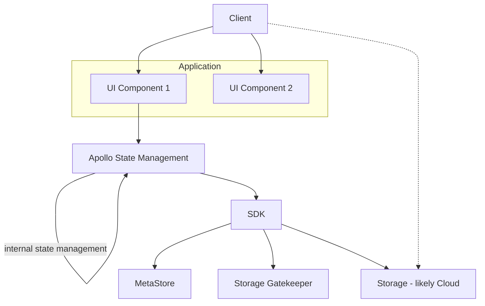

# Publish - Design

## Introduction

Design of a DMS publishing system, with a focus on CKAN v3 / DataHub.

Goal: an elegant single page application (that is easy to reuse and customize) that takes you from choosing your data file to a data package. Aka "a javascript app for turning a CSV into a data package".

This application would form the UI part of a "manual" user flow of importing a data file into a Data Portal.

### The framework approach

As a product, the Publish system should be thought of more as a framework than a single solution: a set of patterns, components and flows that can be composed together to build different applications and workflows.

A given solution is created by composing together different components into an overall flow. 

This approach is is designed to be extensible so that new workflows and their requirements can be easily accommodated.

## Design

### Principles and Remarks

* Simplicity: a focus on extraordinary, easy and elegant user experience
* Speed: not only responsiveness, but also speed to being "done"
* Tabular: focus on tabular data to start with
* Adaptable / Reusable: this system should be rapidly adaptable for other import flows
	* A copy-and-paste-able template that is then adapt with minor changes
  * Over time this may evolve to something configurable
* CKAN-compatible (?): (Longer term) e.g. be able to reuse ckanext-scheming config

### Technology

* Build in Javascript as a SPA (single page application)
* Use React as the framework
* ? Assume we can use NextJS as the SSR/SSG app
* Use Apollo local storage (rather than Redux) for state management

### Architecture

* Encapsulate interaction with backend in a library. Backend is CKAN MetaStore and Blob Storage access, raw Blob Storage itself (almost certainly cloud)
* Split UI into clear components and even sub-applications (for example, a sub-application for resource adding)
* All internal data related objects: Dataset, Resource, Table Schema etc will be in [Frictioness format][f11s]

Diagram: SDK library encapsulates interaction with backend



Working assumptions

* Permissions is "outside" of the UI: we can assume that UI is only launched for people with relevant permissions and that permissions are ultimately enforced in the backend (i.e. if someone attempts to save a dataset they don't have permission for that will fail in the call to the backend). => we don't need to show/hide/restrict based on permissions.

## Key Flows

* **Ultra-simple resource(s) publishing**: Publish/share a resource (file) *fast* to a new project (and dataset) - ultra-simple version (like adding a file to Drive or DropBox)
  * Implicitly creates a project and dataset
* **Publish resource(s) and make a dataset** Publish a file and create the dataset explicitly (ie. add title, license etc)
* **Add resource(s) to a dataset**: a new resource to an existing dataset
  * Add multiple resources at once
* Edit the metadata of an existing dataset

Qu:

* Do we even permit the super simple option - it's attractive but it brings some complexity in the UI 
(either we need to make user provide project/dataset level metadata at end or we guess it for them and guessing usually goes wrong). Note that Github makes you create the "project" and its repo before you can push anything.

## Components

UI

* File uploader
* Resource 

SDK

* File upload
* MetaStore
  * (Project creation / updating)
  * Dataset creation / updating
* ...

## Plan of Work

Task brainstorm

* 

```mermaid
graph TD
```

## Design Research

### Uploading library

Atm we implement from "scratch". Could we use an "off the shelf" solution e.g. uppy

Impressions of uppy:

- Good support
- Open-source MIT
- Beautiful design
- Customizable
- Support (dropbox, google drive, AWS S3, Tus, XHR)

Question:

* how to implement uppy + CKAN SDK?
* support for azure https://github.com/transloadit/uppy/issues/1591 (seems like it can work but maybe issue with large files (?))

[f11s]: https://f11s.com/
