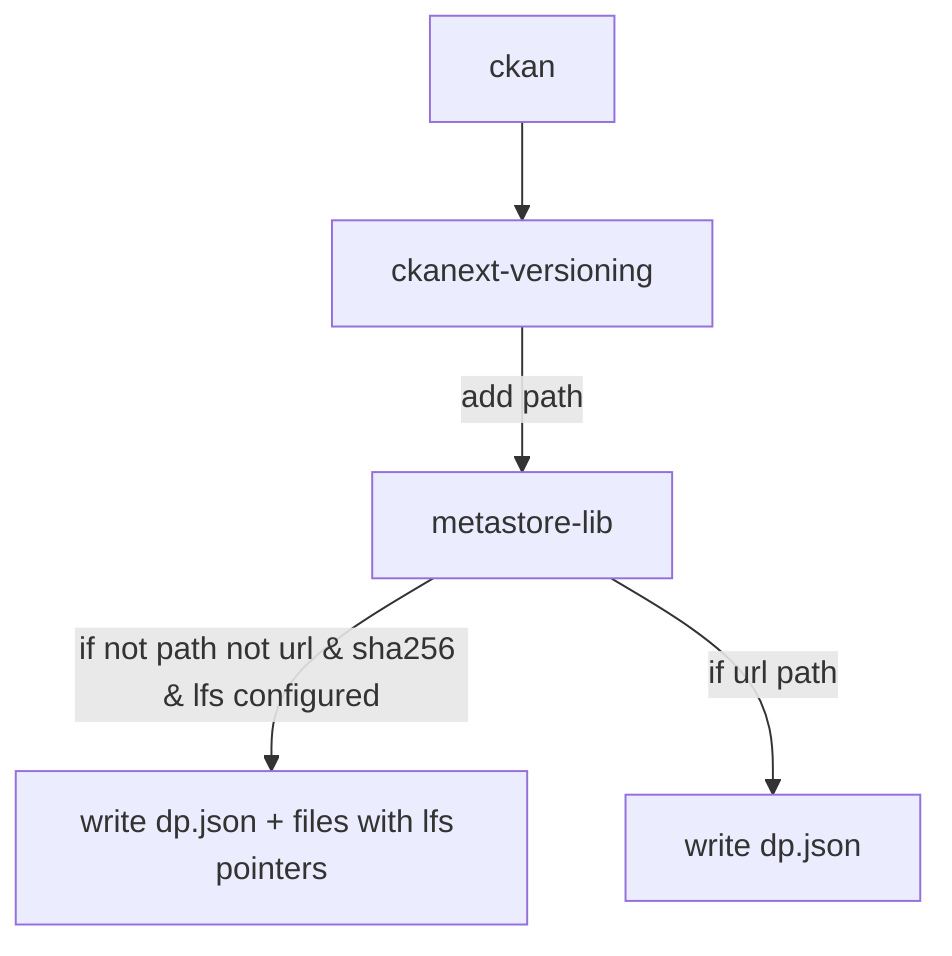

# Versioning Analysis and Design

## The Advantages of a Git-Based Approach

* Excellent command line support out of the box (git)
* Full revisioning and tagging and more (e.g. branches) in an extremely robust system
* Support for non-dataset files in same place ... (e.g. code, visualization, data processing, data analytics)

### What shall we use to create the Hub part of the DataHub

* CKAN Classic MetaStore
* Gitea or Gitlab or Github ...

For now definitely CKAN Classic MetaStore

### What shall we use to create / manage git repos for us?

* GitHub
* Gitea
* Azure Git Repos https://azure.microsoft.com/en-us/services/devops/repos/

## Metadata flow

