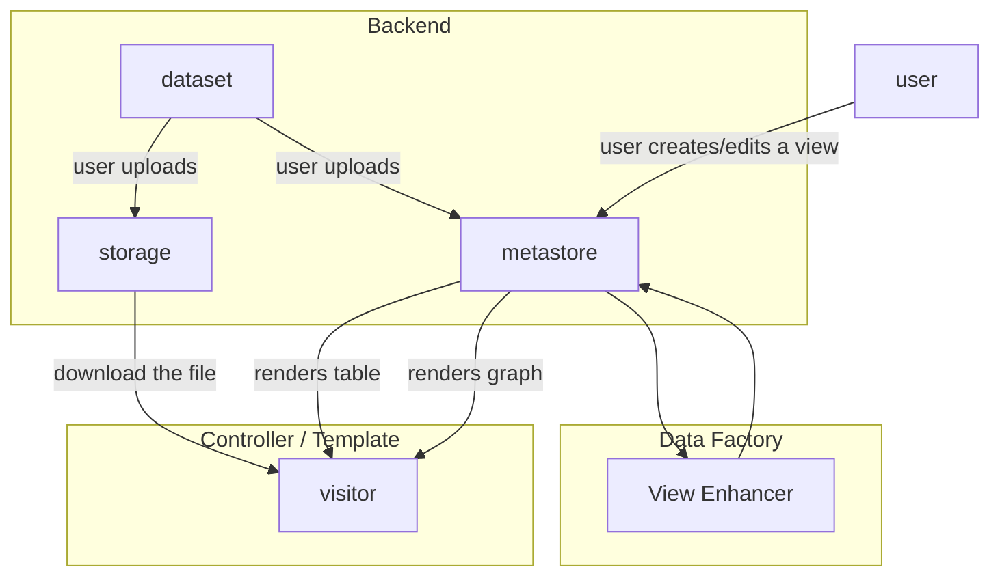
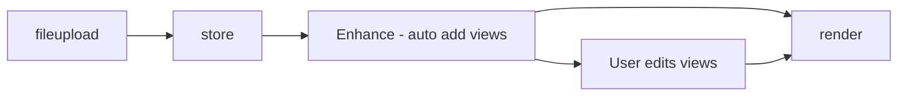

# Data Views

## Introduction

Publishers and users of data want data presented in tables, graphs and maps for a variety of reasons from simple eyeballing to drawing out key insights. We collect all ways of presentating data in ways that makes it more human "viewable" under the term "views" or "data views".

```mermaid
graph LR
  data[Your Data] --> table[Table]
  data --> graph[Graph]
```

To be able to present data in this way this we need to provide:

* A descriptive language for specifying a view particular presentations such as tables, graph and maps.
* A tool-chain to create these presentations from specifications and the data.
* Tooling to allow users to create these views

## Definitions

* Preview: a display (of a sample) of a resource
* Previewer: a method for previewing specific raw data types e.g. csv, excel, json, xml, text, geojson etc …
* Viz: table, graph, map, ... (visualizations)
* Viz Builder: a UI for creating graphs, maps etc
* Query UI: a UI for building queries of a dataset
* Explorer: Query UI + Viz Builder + Viz (renderer)

## Features

Definitions for feature clusters

* View: "(pre)view" a variety of data formats, most importantly tabular and geodata, and extending to PDFs, JSON HTML etc.
  * Tabular:
  * Geo:
  * Chart:
  * Maps:
  * Everything else: this is more a preview
  * Pluggable system
  * Resource proxy (cors issues)
* [Data Explorer][]: think "tableau lite", a rich app for querying/loading data and then displaying that in tables, charts, maps etc.
* Builders:
  * Query Builder:
  * Chart Builder: a wizard for building charts
  * Map Builder
    * Lite: set popups etc.
    * Complex: think carto
* Rich Viz: bespoke, complex visualization
* Dashboard: something that has many widgets displayed at once
  * Basic: no linkage between widgets (basic controls)
  * Complex: linkage between widgets (e.g. zooming on the map changes the map, or clicking the map changes the charts)

[Data Explorer](/data-explorer/)


## CKAN v2

In CKAN v2 and earlier this is provided by the internal view object plus ReclineJS.

* Controller / Template = frontend controller, templating library or even browser JS
* "Data Factory" is a fancy name for any business logic that automatically adds views to a dataset. In CKAN 2 this happens as part of the resource creation logic



The sequence of it ...



## CKAN v3

In CKAN v3 and DataHub these are provied through the use of Frictionless (Data Package) "Views" and associated tooling.
