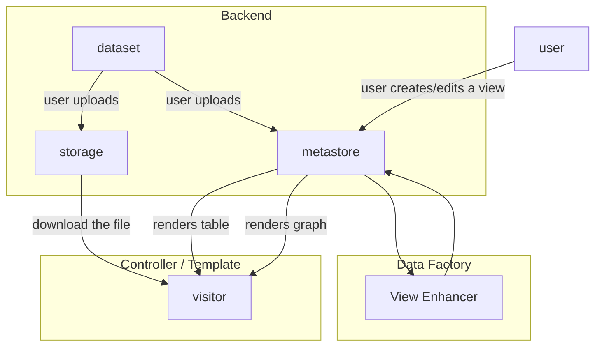
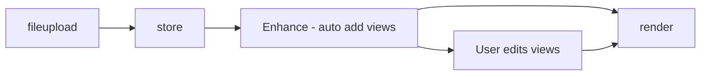

# Data Views

Views of data e.g. tables, graphs, maps.

## How it Works in CKAN

* Controller / Template = frontend controller, templating library or even browser JS
* "Data Factory" is a fancy name for any business logic that automatically adds views to a dataset. In CKAN 2 this happens as part of the resource creation logic

The sequence of it ...

